<h1 align="center">PDV</h1>

<h3 align="center">Venda rápido, controle o estoque e saiba quanto o seu negócio lucra.</h3>

  Caixa, trocas e condicional, estoque, compras, clientes, financeiro, etiquetas, delivery e loja online em um só sistema. 
  Instala sozinho em um minuto e continua vendendo mesmo <b>sem internet</b>.

  <a href="https://github.com/G4Nobrega11/pdv-downloads/releases/latest/download/PDV-Instalador.exe"><b>Baixar e testar grátis por 7 dias</b></a>
  &nbsp;·&nbsp; Windows 10 e 11

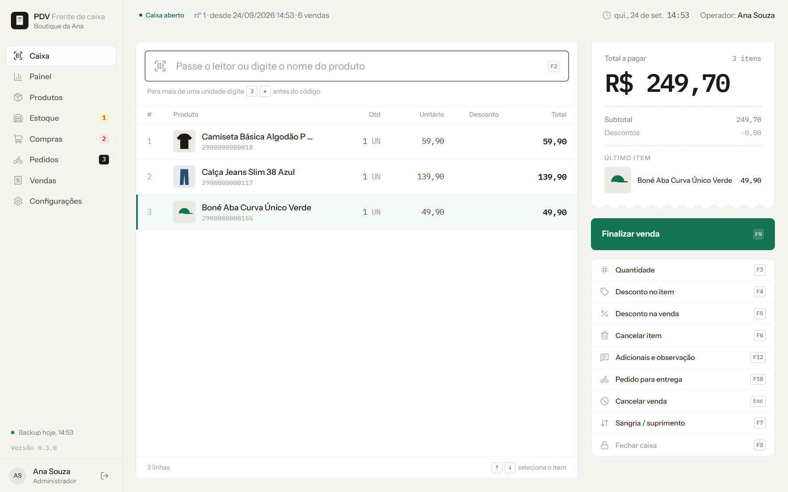

---

## Para quem é

Para quem quer vender rápido, saber quanto ganha e parar de perder dinheiro com estoque errado, sem pagar caro por um sistema complicado.

| Tipo de negócio | O que o sistema resolve |
|---|---|
| **Roupas e calçados** | Grade de tamanho e cor, etiqueta com código de barras para cada peça, troca com vale-troca e condicional (o cliente leva para provar) |
| **Mercadinho, insumos e granel** | Venda por peso (kg, g, litro, metro), preço de atacado automático, leitor de código de barras |
| **Lanchonete e restaurante** | Adicionais (bacon, borda), observação por item, via da cozinha, delivery e retirada |
| **Comércio em geral** | Tudo o que está acima, ligado ou desligado conforme a sua necessidade |

## Por que este sistema

- **Não para quando a internet cai.** Tudo fica salvo no computador da loja. A internet só é usada para ativar e para os módulos online.
- **Rápido de verdade.** Venda inteira pelo teclado e pelo leitor: bipou, apertou F9, recebeu. Aperte F1 em qualquer tela para ver os atalhos.
- **Fácil para quem nunca usou sistema.** O próprio sistema encontra a impressora, explica o que fazer e testa antes de salvar.
- **Seus dados protegidos.** Ficam no computador da loja, com backup automático, usuário e permissão para cada pessoa e histórico de tudo o que foi feito. Veja [Segurança dos seus dados](#segurança-dos-seus-dados).
- **Atualiza com um clique.** As melhorias chegam pela internet e aparecem como "Atualização pendente": clique, confirme e o sistema reinicia já atualizado, com um backup antes. Ao abrir a versão nova, ele mostra o que mudou.
- **Traga o que você já tem.** Importe seus produtos, fornecedores, clientes e até o histórico de vendas de uma planilha do Excel ou de outro sistema.

---

## O que ele faz

### Caixa rápido

Leitor de código de barras ou busca por nome, com a lista de produtos aparecendo enquanto você digita. Quantidade com `3*` antes do código, desconto com senha do gerente, várias formas de pagamento na mesma venda, troco calculado, sangria e suprimento, fechamento com conferência de cada forma de pagamento. Precisa cancelar ou reimprimir uma venda do dia? **Ctrl H** mostra as vendas de hoje sem sair do caixa. Cupom em impressora térmica (80 ou 58 mm) ou em folha A4.

### Trocas, devoluções e condicional

Em todos os planos.

- **Troca pela venda.** Bipe o cupom ou digite o número da venda, marque as peças que voltaram e o motivo. O valor é o que o cliente pagou, já com a parte dele no desconto da venda.
- **Vale-troca** com código de barras e validade: vale no caixa, inteiro ou em parte, e o saldo continua no mesmo vale. Ou **troca na hora** (Ctrl T): a peça volta e paga a nova, e a diferença é paga ali mesmo.
- **Devolver o dinheiro**, o PIX ou estornar o cartão, se a sua loja fizer: só com a permissão ou a senha de quem libera, e a saída entra no fechamento do caixa. Venda no fiado? A troca abate as parcelas em aberto. Peça com defeito sai do estoque como perda.
- **Condicional** (Ctrl L): o cliente leva as peças para provar, com comprovante para assinar e prazo para devolver ou pagar. O que volta entra no estoque; o que fica é pago no caixa. Condicional atrasado aparece no painel.
- O painel de vendas e o resultado do mês já descontam as trocas.

### Painel de vendas

No plano Básico, o painel mostra o essencial: vendido hoje e ontem, ticket médio, os últimos 7 dias, os mais vendidos da semana e o estoque em alerta. Nos planos Médio e Completo, o painel completo:

Faturamento, número de vendas, ticket médio, lucro bruto e itens vendidos, sempre comparados com o período anterior. Vendas por dia e por hora, formas de pagamento, produtos e categorias que mais vendem, vendas por operador e o **mapa de dias e horários de movimento**, para escalar a equipe e programar a reposição.

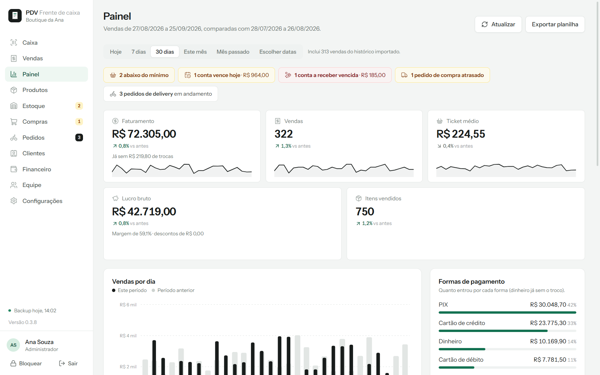

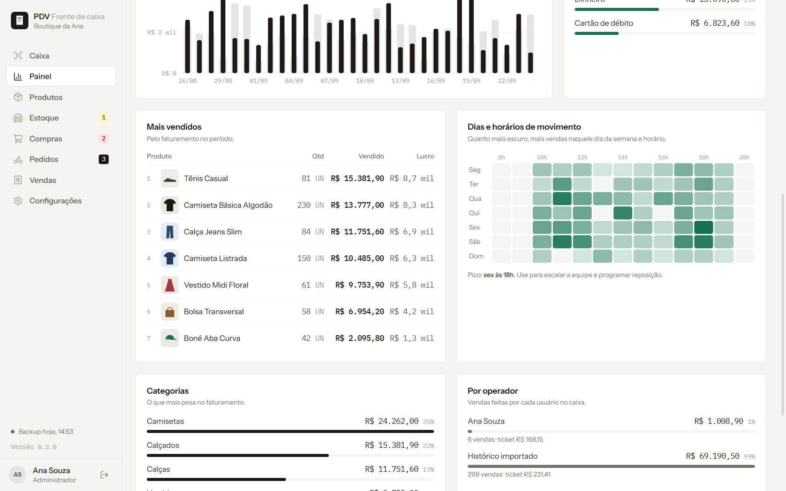

No topo do painel ficam os **alertas**: produtos zerados e abaixo do mínimo, contas vencidas ou vencendo hoje, pedidos de compra atrasados, pedidos de delivery em andamento e dinheiro parado em produtos que não vendem há 60 dias. O menu lateral mostra os números também (quantos produtos repor, quantas contas vencem).

### Estoque

Quanto você tem, quanto vale (pelo custo e pelo preço de venda), o que precisa repor e tudo o que entrou e saiu. Entrada de mercadoria bipando as peças da nota, inventário com o leitor (dá para continuar vendendo durante a contagem), perdas e avarias com motivo, movimentações com filtro e planilha para o contador.

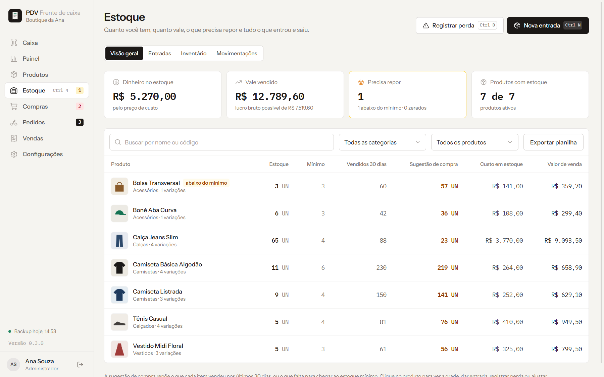

### Compras

Do "o que comprar" até pagar o fornecedor:

- **O que comprar**: o sistema calcula a reposição pela média de vendas de cada tamanho e cor, desconta o que já foi pedido e ainda não chegou e garante o estoque mínimo. Separado por fornecedor, com o pedido mínimo de cada um.
- **Pedido de compra**: monte em segundos a partir da sugestão e mande pelo WhatsApp do fornecedor (a conversa já abre com o pedido), em PDF ou copiando o texto. Cada pedido mostra se já foi mandado, se chegou uma parte ou se chegou tudo.
- **Recebimento com conferência**: chegou uma parte? Informe o que chegou; o resto fica em aberto. O estoque e o custo são atualizados e já dá para imprimir as etiquetas das peças que chegaram.
- **Preço pelo markup**: defina o markup da loja, de cada categoria ou de um produto, e o sistema sugere o preço de venda pelo custo. Mostra os produtos com o preço abaixo do sugerido e corrige todos de uma vez.
- **Fornecedores**: contato, WhatsApp, prazo de entrega, condição de pagamento, histórico de compras e último custo de cada produto.
- **Contas a pagar** (com o Financeiro): as parcelas do fornecedor (30/60/90) entram sozinhas no recebimento.

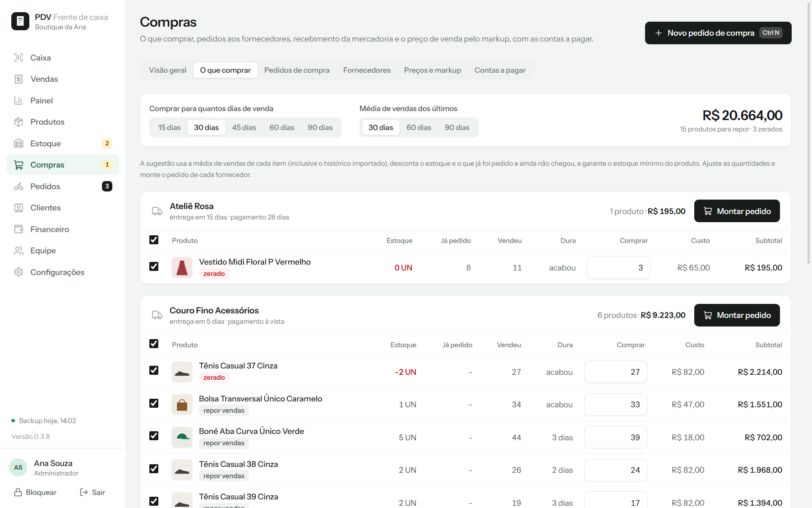

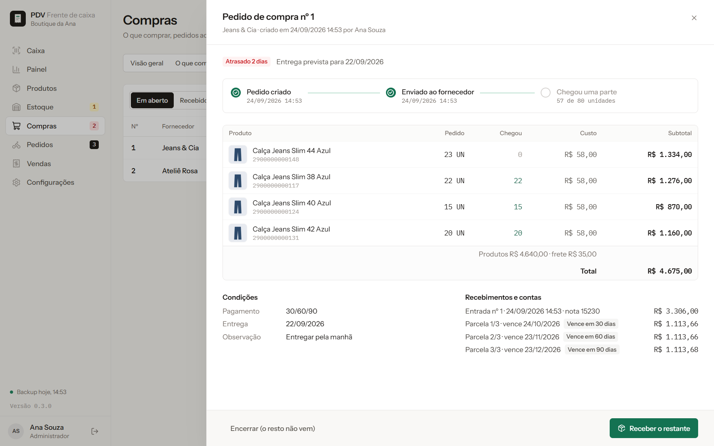

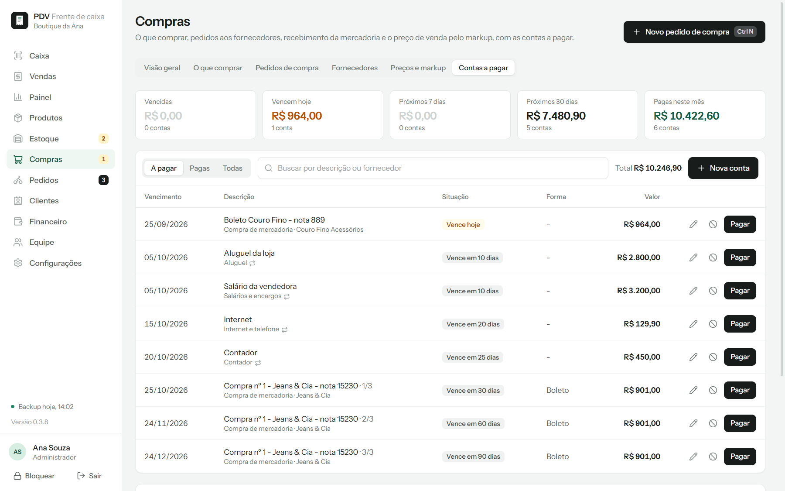

### Clientes

Cadastro com CPF ou CNPJ, WhatsApp, aniversário e endereço. No caixa, **Ctrl I** escolhe o cliente: o nome e o CPF saem no cupom e a compra fica no cadastro dele. Você escolhe como o caixa trata o cliente: não usar (balcão rápido), opcional ou obrigatório em toda venda. Veja o que cada cliente compra, quanto gasta, os aniversariantes do mês e quem não volta há mais de 90 dias. Cadastros repetidos se juntam num só, e dá para trazer os clientes de uma planilha.

### Financeiro

- **Fiado e crediário no caixa.** O cliente leva e paga depois, de uma vez ou em até 12 parcelas, com carnê impresso. Cada cliente tem um limite de crédito: acima dele, só com a autorização de quem pode liberar.
- **Receber no caixa.** Ctrl I, escolha o cliente e receba: o valor entra no fechamento do caixa, e a multa e os juros de atraso já vêm calculados.
- **Contas a pagar** com vencimentos e alertas: as parcelas das compras entram sozinhas, e o aluguel, a luz e as outras contas de todo mês também.
- **Previsão de caixa**: quanto você vai ter em cada dia dos próximos 30, 60 ou 90 dias, com aviso se o saldo for ficar negativo.
- **Resultado do mês**: quanto o seu negócio lucrou, com as vendas, o custo das mercadorias e as despesas, e os últimos 12 meses para comparar.

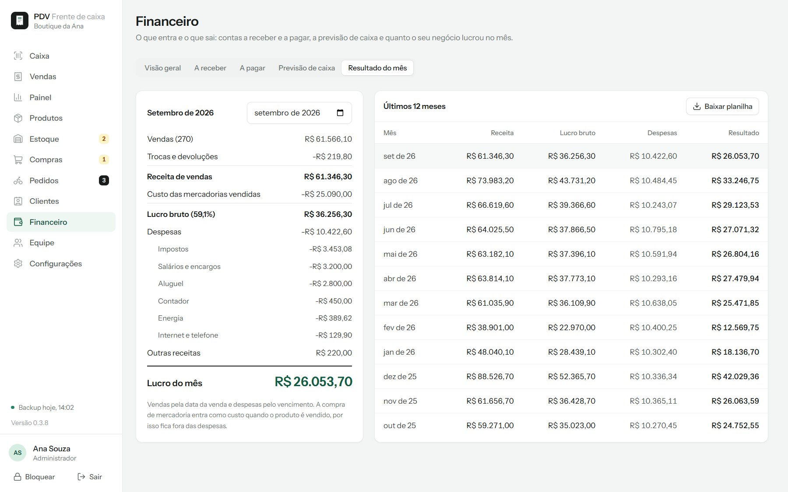

### Etiquetas com código de barras

Para produtos sem código ou com código próprio da loja: etiqueta com ou sem preço, nome da loja e referência. Rolos de etiqueta (40 x 25, 50 x 30, 60 x 40, três colunas, tag de roupa) e folhas A4 adesivas (65, 21 ou 14 etiquetas por folha), aproveitando folha já usada. A quantidade pode vir igual ao estoque em um clique.

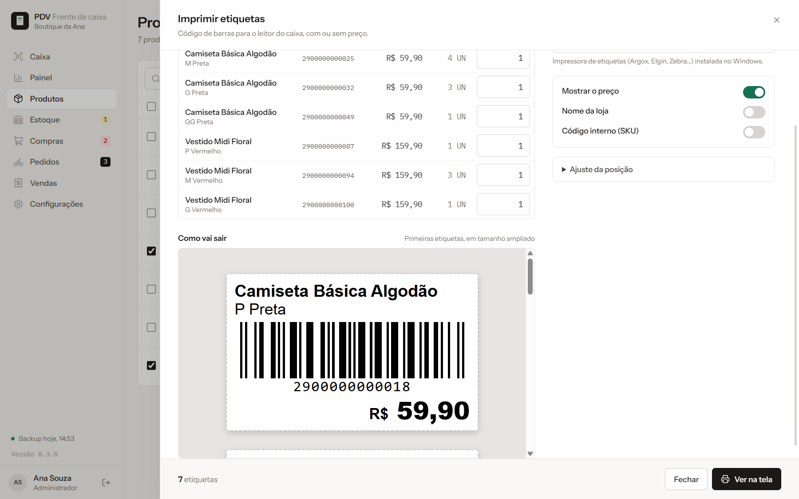

### Importar planilha

Produtos (com grade de tamanho e cor e venda por peso), fornecedores, clientes e histórico de vendas. Excel (.xlsx) ou CSV, inclusive o que outros sistemas exportam. O sistema reconhece as colunas sozinho, mostra **exatamente** o que vai entrar, o que vai ser atualizado e as linhas com problema, e faz um backup antes de importar.

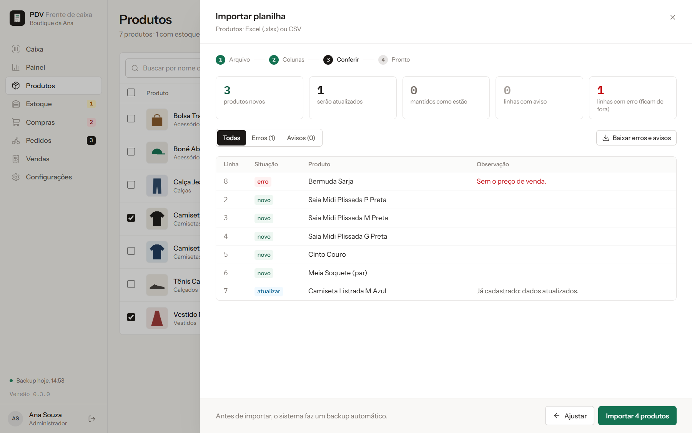

### Delivery, loja online e celular do dono

- **Pedidos para entrega e retirada** feitos no caixa (F10), com acompanhamento, entregador e via da cozinha.
- **Loja online**: uma página com os seus produtos, fotos e preços. O cliente pede pelo celular e o pedido cai direto em Pedidos, com aviso sonoro.
- **Celular do dono**: vendas do dia, caixa, pedidos e estoque baixo no celular, pelo Wi-Fi da loja, ou de qualquer lugar com link e PIN.

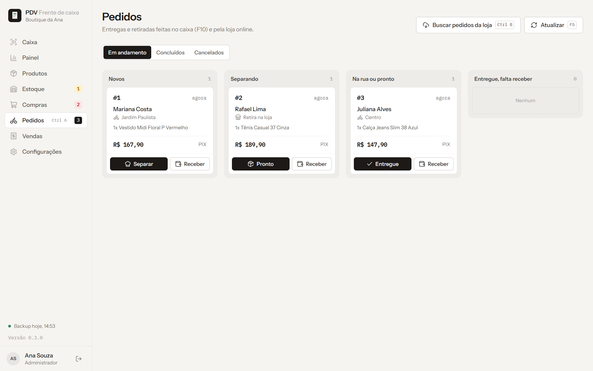

  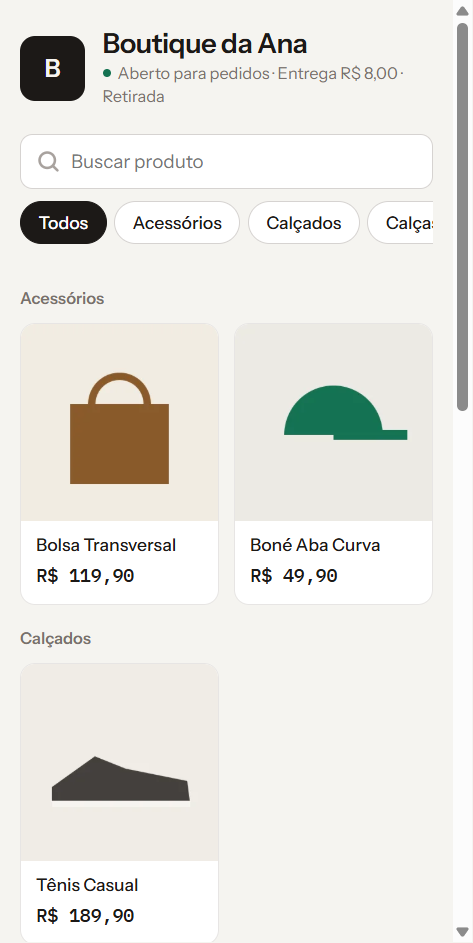
  &nbsp;&nbsp;
  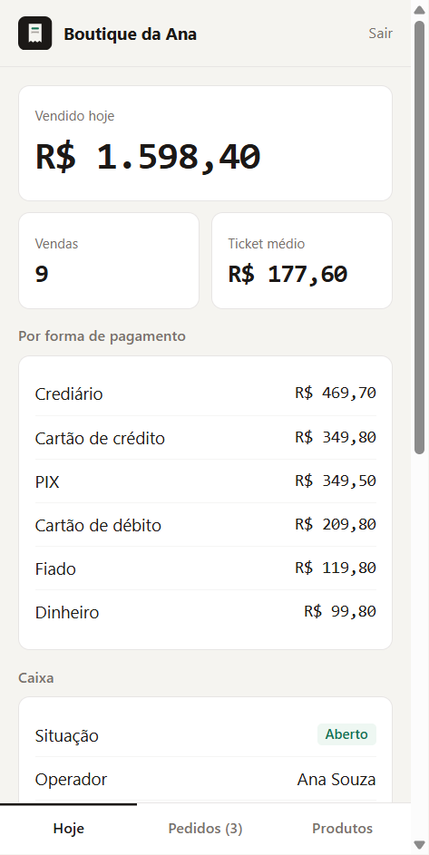

---

## Segurança dos seus dados

São os números do seu negócio: vendas, clientes, custos e contas. O sistema foi feito para eles ficarem com você e só quem você autorizar mexer neles.

- **Ficam no computador da loja.** Vendas, clientes, produtos e contas ficam no seu computador, não num servidor de terceiros. A internet só é usada para ativar, receber atualizações e para os módulos online.
- **Backup automático.** Todo dia, ao fechar o caixa, antes de importar uma planilha e antes de cada atualização. Com cópia extra no pendrive ou na pasta do Google Drive ou do OneDrive, se você quiser.
- **Cada pessoa com o seu usuário.** Perfis prontos (administrador, gerente, caixa, estoquista e financeiro) ou montados do seu jeito. Quem não tem a permissão não vê nem faz, e a trava vale no sistema inteiro, não só na tela.
- **Senhas protegidas.** Senha, PIN e crachá nunca ficam guardados como foram digitados: nem abrindo o banco de dados dá para ler. Cinco tentativas erradas bloqueiam por um minuto.
- **Esqueceu a senha do administrador?** Na tela de entrada, crie uma senha nova com a chave de ativação que veio na compra. Sem a chave, ninguém troca, e a troca fica no histórico.
- **Tudo registrado.** Vendas canceladas, descontos, sangrias, mudanças de preço e de estoque, usuários e permissões: o histórico mostra quem fez, quando e quem autorizou. Dá para exportar em planilha.
- **Autorização na hora, com a senha de quem libera.** Desconto acima do limite, cancelamento, sangria, fiado acima do limite, dispensa de juros, devolução em dinheiro e troca fora da regra só passam com a senha, o PIN ou o crachá de quem pode liberar, digitados na hora. Ninguém usa o nome do gerente sem ele.
- **Vale-troca que não dá para inventar.** O código tem números sorteados e o saldo fica no sistema, não no papel. A segunda via cancela o papel antigo: quem achar o vale perdido não usa o saldo.
- **Fiado com trava.** Limite de crédito por cliente e, se precisar, o bloqueio da venda a prazo para quem está devendo.
- **Troca de operador sem fechar o caixa.** A tela bloqueia com Ctrl B ou sozinha, depois do tempo que você escolher, e volta com o PIN ou o crachá.
- **Celular do dono sem expor a senha.** Pelo Wi-Fi da loja, a senha não passa pela rede. De qualquer lugar, o acesso é por link privado e PIN, com conexão cifrada, e bloqueia depois de 5 PINs errados.
- **Atualização só da fonte oficial.** O sistema só instala versões publicadas pelo fornecedor do sistema, e faz um backup antes.
- **Licença com assinatura digital.** Não dá para falsificar nem copiar para outro computador.
- **Loja online protegida.** O preço do pedido é sempre o do seu cadastro, e o sistema barra quem tenta mandar pedidos em série.

**Dica:** proteja também o computador. Use senha no Windows e, se o seu Windows tiver, ligue a criptografia do dispositivo (BitLocker).

---

## Planos

Pague uma vez só ou por mês. Todos os planos têm 7 dias grátis para testar e recebem as atualizações sem reinstalar nada. Para mudar de plano, peça ao vendedor: os módulos novos aparecem no sistema sem reinstalar.

| | Básico | Médio | Completo |
|---|---|---|---|
| **Pagamento único** | **R$ 49,90** | **R$ 69,90** | **R$ 99,90** |
| **Ou por mês** | R$ 19,90 | R$ 29,90 | R$ 49,90 |
| Computadores | 1 | 2 | 3 |
| Usuários incluídos | 2 | 3 | 5 |
| Caixa, produtos, vendas, cupom, backup e importação de planilhas | Sim | Sim | Sim |
| Trocas, devoluções, vale-troca e condicional | Sim | Sim | Sim |
| Painel de vendas | Simples | Completo | Completo |
| Gestão de estoque | Sim | Sim | Sim |
| Compras, fornecedores e preço pelo markup | - | Sim | Sim |
| Clientes | - | Sim | Sim |
| Etiquetas com código de barras | - | Sim | Sim |
| Celular do dono pelo Wi-Fi da loja | - | 1 celular | 2 celulares |
| Financeiro | - | - | Sim |
| Delivery e pedidos | - | - | Sim |
| Loja online | - | - | Sim |
| Acesso de qualquer lugar (link e PIN) | - | - | Sim |
| Pedidos e estoque do Mercado Livre | - | - | Em breve |

**Usuário extra:** R$ 9,90 por mês para caixa ou vendedor e R$ 14,90 para gerente ou financeiro. No pagamento único, R$ 24,90 e R$ 39,90.

---

## Impressoras

O sistema funciona com praticamente qualquer impressora instalada no Windows. Não precisa de programa extra: se o Windows imprime, o sistema imprime.

### Qual impressora usar

| Para quê | Tipo | Papel | Exemplos |
|---|---|---|---|
| Cupom do caixa (mais comum) | Térmica de cupom | Bobina 80 mm | Elgin i9 e i7, Epson TM-T20, Bematech MP-4200, Daruma DR800, Tanca TP-650, Knup, Gprinter, Xprinter |
| Pouco espaço no balcão | Térmica de cupom | Bobina 58 mm | Mini impressoras térmicas USB ou Bluetooth de 58 mm |
| Cupom sem impressora térmica | Comum (jato de tinta ou laser) | Folha A4 | HP, Epson, Brother, Canon, Samsung |
| Etiquetas em rolo | Térmica de etiquetas | Rolo de etiquetas | Argox OS-214 e OS-2140, Elgin L42 Pro, Zebra GC420t e ZD220 |
| Etiquetas em folha | Comum (jato de tinta ou laser) | Folha A4 adesiva com 65, 21 ou 14 etiquetas | Qualquer impressora comum |

Pode usar uma impressora para o cupom e outra para as etiquetas, e ainda uma terceira para a via da cozinha.

### Primeira vez: passo a passo

1. **Instale a impressora no Windows** com o programa (driver) do fabricante. Ele vem no CD ou no site da marca: procure no Google por "driver" e o modelo da impressora (exemplo: "driver Elgin i9"). Impressora comum (HP, Epson, Brother) costuma instalar sozinha pelo Windows Update.
2. **Ligue a impressora e conecte no computador** (USB ou rede). Coloque o papel.
3. **Abra o sistema.** Na primeira vez ele procura as impressoras e mostra um aviso no topo: "Encontramos a impressora ... Quer usar para os cupons?". Clique em **Usar esta impressora**.
4. **Siga o assistente.** Ele sugere o tamanho do papel pelo modelo, imprime uma página de teste com uma régua e pergunta como saiu. Se saiu cortado, pequeno ou em branco, ele diz exatamente o que ajustar.

Para mudar depois: **Configurações > Impressora e cupom > Configurar passo a passo**.

### O sistema avisa quando algo está errado

- Impressora **ligada no USB mas sem o programa (driver)**: aparece o nome que o aparelho informa, com o passo a passo para instalar.
- Impressora **desligada, sem papel, com a tampa aberta ou com papel enroscado**: a situação aparece no assistente e no aviso do topo da tela, do jeito que o Windows informa.
- **Impressoras virtuais** (PDF, OneNote, programas de acesso remoto) ficam separadas, para não serem escolhidas por engano.

### Problemas comuns

| O que acontece | O que fazer |
|---|---|
| A impressora não aparece na lista | Falta instalar o driver no Windows (passo 1). Depois de instalar, clique em "Procurar de novo" no assistente. |
| O cupom sai cortado dos lados | O papel escolhido está maior que a bobina. No assistente, escolha 58 mm em vez de 80 mm. |
| O cupom sai muito pequeno ou com folha em branco no fim | O driver está configurado para folha A4. Nas preferências da impressora no Windows, escolha o papel de 80 mm (ou 58 mm) e o tamanho "rolo". |
| Sai em branco | Na térmica, a bobina está ao contrário: o lado que escurece com a unha é o que imprime. |
| Imprime devagar ou trava | Impressora de rede com o endereço mudado: reinicie a impressora e o roteador, ou prefira o cabo USB. |
| Etiqueta sai deslocada | Na tela de etiquetas, abra "Ajuste da posição" e mova em milímetros para o lado ou para baixo. |
| Etiqueta A4 não bate com a folha | Confira se o modelo escolhido tem o mesmo número de etiquetas da sua folha. Para aproveitar uma folha já usada, use "Começar em". |
| Quero imprimir a via da cozinha em outra impressora | Configurações > Impressora e cupom > Via da cozinha: escolha a impressora da cozinha. |

### Leitor de código de barras

Não precisa instalar nada: o leitor USB funciona como um teclado. Conecte, abra o caixa e bipe. Se o leitor tiver o modo "enter no final" desligado, ligue pelo manual do leitor (ele lê um código de configuração).

---

## Instalação

**Requisitos:** Windows 10 ou 11 (64 bits), 4 GB de memória, 500 MB livres. Internet só para ativar.

1. [Baixe o instalador](https://github.com/G4Nobrega11/pdv-downloads/releases/latest/download/PDV-Instalador.exe) e abra o arquivo.
2. Se aparecer **"O Windows protegeu o computador"**, clique em **Mais informações** e depois em **Executar assim mesmo**. O aviso aparece com programas novos que ainda não são conhecidos pelo Windows. O instalador é o mesmo publicado nesta página.
3. A instalação termina sozinha e cria o atalho na área de trabalho.
4. Na primeira abertura, informe o nome da loja, o tipo de loja e crie o seu usuário de administrador.
5. Use por 7 dias grátis. Para continuar, digite o código de ativação que você recebeu na compra (Configurações > Licença).

**Trocou de computador?** No computador antigo, vá em Configurações > Licença > Desativar este computador. Depois ative no novo. Se o antigo quebrou, fale com o suporte para liberar.

**Levar os dados para o computador novo:** Configurações > Backup > Restaurar, escolhendo o arquivo de backup (do pendrive ou da nuvem).

---

## Perguntas frequentes

**Precisa de internet?**
Não para vender. A internet é usada para ativar, para receber atualizações e para os módulos online (loja online e acesso de qualquer lugar).

**Emite nota fiscal (NFC-e, SAT)?**
Não. É um sistema de controle da loja (caixa, estoque, compras e financeiro). Quando a nota fiscal for obrigatória para o seu negócio, use junto com o emissor indicado pela sua contabilidade.

**Onde ficam os meus dados?**
No computador da loja, com backup automático todo dia. Você pode escolher uma pasta extra (pendrive, Google Drive, OneDrive) para ter uma cópia fora do computador.

**Posso usar em mais de um computador?**
Depende do plano: 1 no Básico, 2 no Médio e 3 no Completo. Cada computador ativa com o mesmo código, até o limite do plano.

**Funciona com gaveta de dinheiro e balança?**
A gaveta que abre pela impressora térmica depende da configuração do driver da impressora. Balança integrada ainda não: o produto por peso é vendido digitando o peso.

**Tenho os produtos em outro sistema. Preciso cadastrar tudo de novo?**
Não. Exporte uma planilha do sistema antigo (Excel ou CSV) e importe em Produtos > Importar planilha. Dá para trazer também os fornecedores, os clientes e o histórico de vendas.

**Esqueci a senha. E agora?**
Quem não é administrador pede uma senha provisória ao administrador, em Equipe. O administrador clica em "Sou o administrador e esqueci a senha", na tela de entrada, e cria uma senha nova com a chave de ativação da compra. Perdeu a chave? O vendedor manda de novo.

**Como chegam as atualizações?**
Pela internet, sem reinstalar. Quando tiver versão nova, aparece "Atualização pendente" embaixo do menu (e na tela de entrada). Clique, confirme e o sistema reinicia já atualizado, com um backup antes. Se preferir, ela é instalada quando você fechar o sistema.

**Quantos usuários posso criar?**
Depende do plano: 2 no Básico, 3 no Médio e 5 no Completo, e dá para contratar usuários extras de caixa ou de gerência. Cada pessoa tem o seu login, senha, PIN e crachá, com as permissões do perfil dela; descontos acima do limite pedem a autorização de quem pode liberar.

---

## Suporte

Fale com quem te vendeu o sistema, pelo WhatsApp informado na compra. Dentro do sistema, os módulos que não estão no seu plano têm o botão **Pedir para liberar**, que já abre a conversa com a mensagem pronta.

  <a href="https://github.com/G4Nobrega11/pdv-downloads/releases/latest/download/PDV-Instalador.exe"><b>Baixar o instalador para Windows</b></a>

