<h1 align="center">PDV</h1>

<h3 align="center">Venda rápido, controle o estoque e saiba quanto o seu negócio lucra.</h3>

  Caixa com Pix e maquininha integrados, vários caixas no mesmo estoque, trocas e condicional, estoque, compras, clientes, financeiro, relatórios, etiquetas, delivery, loja online e Mercado Livre em um só sistema. 
  Instala sozinho em um minuto e continua vendendo mesmo <b>sem internet</b>.

  <a href="https://github.com/G4Nobrega11/pdv-downloads/releases/latest/download/PDV-Instalador.exe"><b>Baixar e testar grátis por 7 dias</b></a>
  &nbsp;·&nbsp; Windows 10 e 11

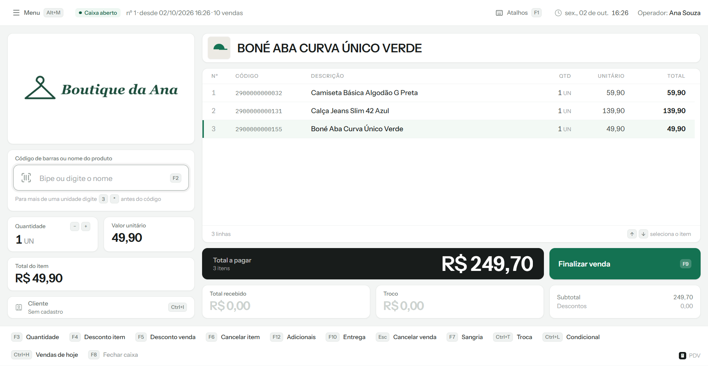

  <b>Duas telas de caixa, você escolhe:</b> a de mercado (acima), com a logo da loja e os valores grandes, ou a <a href="#caixa-rápido">clássica</a>, com a foto de cada peça. 
  Para trocar, Configurações &gt; Caixa e leitor, em cada computador.

---

## Para quem é

Para quem quer vender rápido, saber quanto ganha e parar de perder dinheiro com estoque errado, sem pagar caro por um sistema complicado.

| Tipo de negócio | O que o sistema resolve |
|---|---|
| **Roupas e calçados** | Grade de tamanho e cor, etiqueta com código de barras para cada peça, troca com vale-troca e condicional (o cliente leva para provar), caixa com a foto de cada peça |
| **Mercadinho, depósito, padaria, açougue e granel** | Caixa no formato de mercado (a logo da loja no canto, o produto, o total e o troco em letras grandes), venda por peso (kg, g, litro, metro), etiqueta da balança lida no caixa, balança ligada ao computador, preço de atacado automático, leitor de código de barras, validade e lote com o aviso do que vai vencer |
| **Pet shop, cosméticos, agropecuária e quem vende com validade** | Validade e lote de cada produto, com o lote que vem no XML da nota, o caixa que pergunta o lote quando precisa e o inventário por lote |
| **Lanchonete e restaurante** | Adicionais (bacon, borda), observação por item, via da cozinha, delivery e retirada |
| **Comércio em geral** | Tudo o que está acima, ligado ou desligado conforme a sua necessidade |

## Por que este sistema

- **Não para quando a internet cai.** Tudo fica salvo no computador da loja. A internet só é usada para ativar e para os módulos online.
- **Vários caixas, um estoque só.** Os computadores da loja vendem do mesmo estoque, pela rede da loja e sem precisar de internet, cada caixa com a sua gaveta, a sua impressora e a sua maquininha.
- **Rápido de verdade.** Venda inteira pelo teclado e pelo leitor: bipou, apertou F9, a tecla da forma de pagamento (F2 dinheiro, F3 PIX, F5 crédito) e Enter. A venda termina na hora, sem esperar a impressora, e todas as teclas ficam à vista no caixa. Aperte F1 em qualquer tela para ver a lista: nenhum atalho passa de duas teclas, e quem tem dificuldade de apertar duas juntas encontra ali como apertar uma de cada vez.
- **Caixa do jeito da sua loja.** Duas telas de caixa, e você escolhe. A de mercado tem a logo da loja grande no canto e o produto que passou, o total, o recebido e o troco em letras grandes, para ler de longe, usando a tela inteira: é a que vem no mercadinho e no depósito. A clássica mostra a foto de cada peça e as teclas em botões ao lado da venda: é a que vem em roupas e lanchonete. Para trocar, Configurações > Caixa e leitor, em cada computador.
- **Pix que não dá para fingir.** A venda só fecha quando o Pix cai na conta. O cliente lê o QR na maquininha, num monitor virado para ele ou no papel: ninguém vira a tela do caixa.
- **Fácil para quem nunca usou sistema.** O próprio sistema encontra a impressora, explica o que fazer e testa antes de salvar.
- **Tudo fácil de achar.** O menu separa o sistema por área: Vendas, Produtos, Financeiro, Painel. Passe o mouse numa área e as telas dela abrem ao lado, com as partes de cada uma; um clique leva direto. Pelo teclado, Alt+M abre o menu e as setas escolhem.
- **Um assistente para perguntar.** No topo do menu, "Buscar ou perguntar" (ou Ctrl+Espaço, de qualquer tela): escreva "cadastro de produto" e o Enter leva até a tela; pergunte "como faço uma troca?" e veja o passo a passo com as teclas. No plano Completo, pergunte também "quanto vendi hoje?" ou "o que está acabando no estoque?": a resposta vem com os números da loja e a fonte de cada um. Funciona sem internet, e cada pessoa só vê o que o perfil dela permite.
- **Telas limpas, claras ou escuras.** Feitas para o dia inteiro no caixa, com os números alinhados e o que importa em destaque, e usando a tela inteira em qualquer monitor, do notebook ao monitor grande. Escolha o tema claro, o escuro ou o mesmo do Windows.
- **Com a cara da sua loja.** Ponha a sua logo e ela aparece no menu, no canto do caixa de mercado, na tela de entrada, no cupom e na loja online. Qualquer imagem serve: o sistema tira as bordas vazias e ajusta sem cortar.
- **Seus dados protegidos.** Ficam no computador da loja, com backup automático, usuário e permissão para cada pessoa e histórico de tudo o que foi feito. Veja [Segurança dos seus dados](#segurança-dos-seus-dados).
- **Suporte dentro do sistema.** Aperte Ctrl+F1 em qualquer tela, conte o que aconteceu e o chamado vai com o print da tela para a equipe do sistema. A resposta aparece ali mesmo, e o menu avisa quando chegar.
- **Atualiza com um clique.** As melhorias chegam pela internet e aparecem como "Atualização pendente": clique e confirme. Uma barra mostra o andamento (quanto já baixou, a velocidade e quanto falta), o backup é feito antes, a instalação aparece na tela e em cerca de 30 segundos o sistema abre de novo, já atualizado e com você conectado. Ao abrir a versão nova, ele mostra o que mudou.
- **Traga o que você já tem.** Importe seus produtos, fornecedores, clientes e até o histórico de vendas de uma planilha do Excel ou de outro sistema.

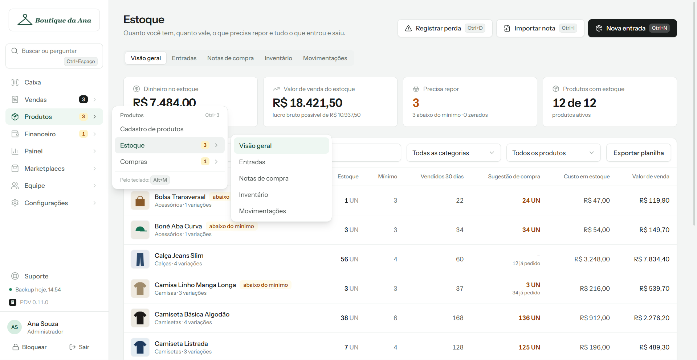

---

## O que ele faz

### Caixa rápido

Leitor de código de barras ou busca por nome, com a lista de produtos aparecendo enquanto você digita. Várias unidades do mesmo produto: `5*` antes do bipe (a quantidade aparece na tela antes de bipar) ou bipe uma vez e aperte **+** e **−** no teclado numérico, código da caixa fechada que vende a quantidade dela (a caixa com 12, o fardo com 6), desconto com senha do gerente, várias formas de pagamento na mesma venda, troco calculado, sangria e suprimento, fechamento com conferência de cada forma de pagamento. Precisa cancelar ou reimprimir uma venda do dia? **Ctrl+H** mostra as vendas de hoje sem sair do caixa. Cupom em impressora térmica (80 ou 58 mm) ou em folha A4.

**Duas telas de caixa, você escolhe:**

- **Mercado**: a logo da sua loja grande no canto, o produto que passou em letras grandes, a lista com o código, a quantidade, o valor unitário e o total do item, e o total a pagar, o recebido e o troco em números grandes, para o operador e o cliente lerem de longe. Depois da venda, o recebido e o troco ficam na tela até passar o próximo produto. O caixa usa a tela inteira: o menu fica recolhido e abre por cima com Alt+M ou com o botão Menu. As teclas ficam numa faixa embaixo, todas à vista. É a que vem no mercadinho e no depósito.
- **Clássica**: a lista com a foto de cada peça, o total ao lado e as teclas em botões, com o menu à vista. É a que vem em roupas e lanchonete.

Para trocar, Configurações > Caixa e leitor > Tela do caixa. Cada computador da loja usa a que preferir. A de mercado está no topo desta página; a clássica é esta:

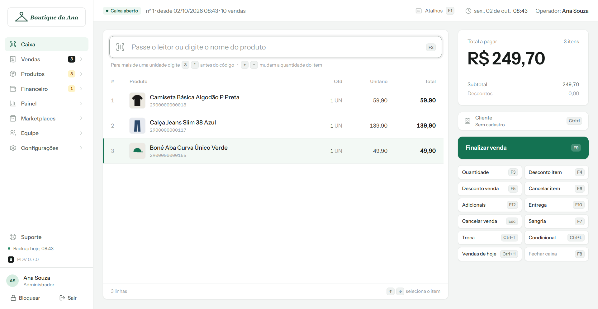

### Assistente

Não sabe onde fica uma tela? Escreva no campo **Buscar ou perguntar**, no topo do menu, ou aperte **Ctrl+Espaço** em qualquer tela. Enquanto você digita, aparecem as telas, o passo a passo e as perguntas que combinam: setas e Enter, e você está lá.

- **Ache qualquer tela pelo nome** (todos os planos): "cadastro de produto", "contas a pagar", "fornecedores", "backup". Vale escrito de qualquer jeito, sem acento ou com uma letra trocada.
- **Veja como fazer** (todos os planos): "como fecho o caixa?", "como dou entrada de mercadoria?", "como imprimo etiquetas?". O passo a passo vem com as teclas e um botão que leva até a tela (Ctrl+Enter).
- **Pergunte sobre a loja** (plano Completo): "quanto vendi hoje?", "o que mais vendeu esta semana?", "quanto lucrei este mês?", "quanto entrou no Pix?", "o que está acabando?", "quem está com o fiado atrasado?", "tem lote vencido?", "quanto custa o arroz?". Os números são os mesmos do Painel e das outras telas.
- **Hoje na loja** (plano Completo): ao abrir, as vendas do dia e o que pede atenção (produto para repor, conta vencendo, lote vencido); um clique pergunta.
- **Com a fonte de cada número:** embaixo de toda resposta, de onde veio (a tela, o período e o que entra na conta), para não ficar dúvida. Pergunte "de onde veio isso?" e ele explica.

A resposta aparece como numa conversa, depois de o assistente "escrever", e cada número vem com a fonte. Funciona sem internet, sem custo por pergunta, e cada pessoa só vê o que o perfil dela permite.

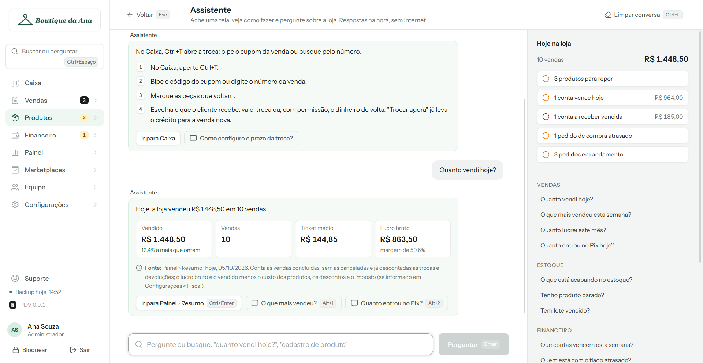

### Vários caixas no mesmo estoque

Nos planos Médio (2 computadores) e Completo (3).

- **Um estoque só.** O computador principal guarda os dados da loja e os outros viram caixas dele, pela rede da loja (cabo ou Wi-Fi), sem precisar de internet. Vendeu em um caixa, o estoque baixa para todos.
- **Cada caixa com o que é dele.** O caixa aberto, a gaveta, a impressora, a balança e a maquininha são de cada computador. No Financeiro, cada gaveta aparece com o nome do computador.
- **Ligar um caixa leva um minuto.** No principal, Configurações > Computadores da loja mostra um código. No outro computador, digite o código e confira o número que aparece igual nas duas telas.
- **Sem o principal, o caixa continua vendendo.** Se o principal desligar ou a rede cair, o caixa segue vendendo com dinheiro, cartão e Pix, abre e fecha o caixa e faz sangria. Um aviso no topo mostra quantas vendas estão guardadas no caixa, e elas vão sozinhas para o principal quando ele volta, com a hora e o preço de quando foram feitas.
- **O cupom acha a venda depois.** A venda feita sem o principal sai no cupom com um número do caixa ("2-15"), que acha a venda em Vendas e na troca depois que ela chega ao principal.

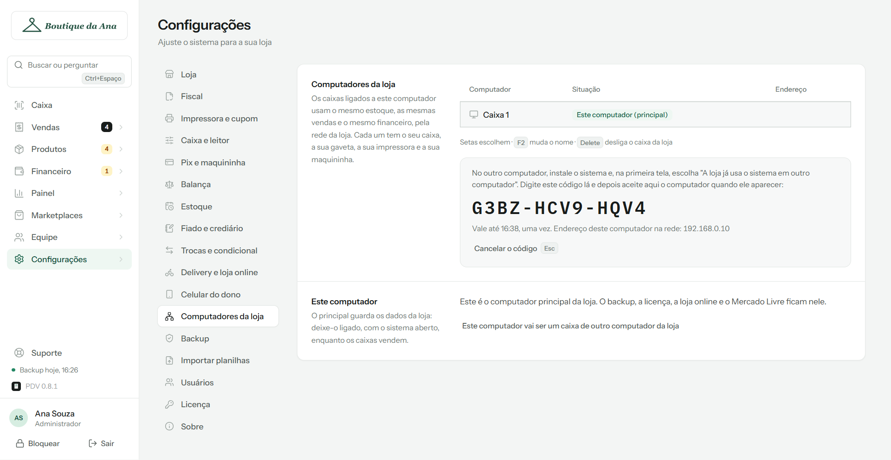

### Pix e maquininha integrados

Em todos os planos.

- **Pix sem comprovante falso.** O caixa gera o Pix do valor exato e a venda fecha sozinha quando o dinheiro cai, pelo Mercado Pago ou direto na conta do banco (Efí, Inter, Banco do Brasil, Sicoob, Itaú, Santander, Bradesco, Caixa e outros).
- **Ninguém vira a tela.** O QR aparece na maquininha (Cielo Smart e TEF), num segundo monitor virado para o cliente ou impresso na bobina, e o cliente lê com o celular.
- **O valor vai direto para a maquininha.** Mercado Pago Point, Cielo Smart e SumUp Solo recebem o valor do caixa; Stone, PagBank, Getnet, Rede e outras integram pelo TEF. O operador não digita nada na maquininha, a venda fecha com a aprovação e o cupom sai com a bandeira, o final do cartão e o NSU.
- **Configuração pela marca.** Escolha a marca da sua maquininha e o sistema mostra o caminho certo. O Mercado Pago conecta com um clique, sem copiar senha.
- **Sem internet, a venda continua:** lance o cartão ou o Pix à mão, com a autorização de um gerente. Cancelou a venda? O dinheiro volta ao cliente pelo próprio provedor.

A conta do Mercado Pago, a API Pix do banco e o TEF são contratados pela loja, com as tarifas de cada um.

### Balança

Em todos os planos.

- **Etiqueta da balança no caixa.** A etiqueta que a balança imprime (Toledo, Filizola, Urano, Elgin e outras) entra bipada, com o produto e o valor certos, pelo preço ou pelo peso. É só pôr no cadastro o código do produto na balança.
- **Balança ligada ao computador.** Ao lançar um produto vendido por peso, o caixa lê o peso sozinho. Peso mexendo, zerado ou sem resposta: o sistema avisa e deixa digitar. Ctrl+K pesa de novo.

### Trocas, devoluções e condicional

Em todos os planos.

- **Troca pela venda.** Bipe o cupom ou digite o número da venda, marque as peças que voltaram e o motivo. O valor é o que o cliente pagou, já com a parte dele no desconto da venda.
- **Vale-troca** com código de barras e validade: vale no caixa, inteiro ou em parte, e o saldo continua no mesmo vale. Ou **troca na hora** (Ctrl+T): a peça volta e paga a nova, e a diferença é paga ali mesmo.
- **Devolver o dinheiro**, o PIX ou estornar o cartão, se a sua loja fizer: só com a permissão ou a senha de quem libera, e a saída entra no fechamento do caixa. Venda no fiado? A troca abate as parcelas em aberto. Peça com defeito sai do estoque como perda.
- **Condicional** (Ctrl+L): o cliente leva as peças para provar, com comprovante para assinar e prazo para devolver ou pagar. O que volta entra no estoque; o que fica é pago no caixa. Condicional atrasado aparece no painel.
- O painel de vendas e o resultado do mês já descontam as trocas.

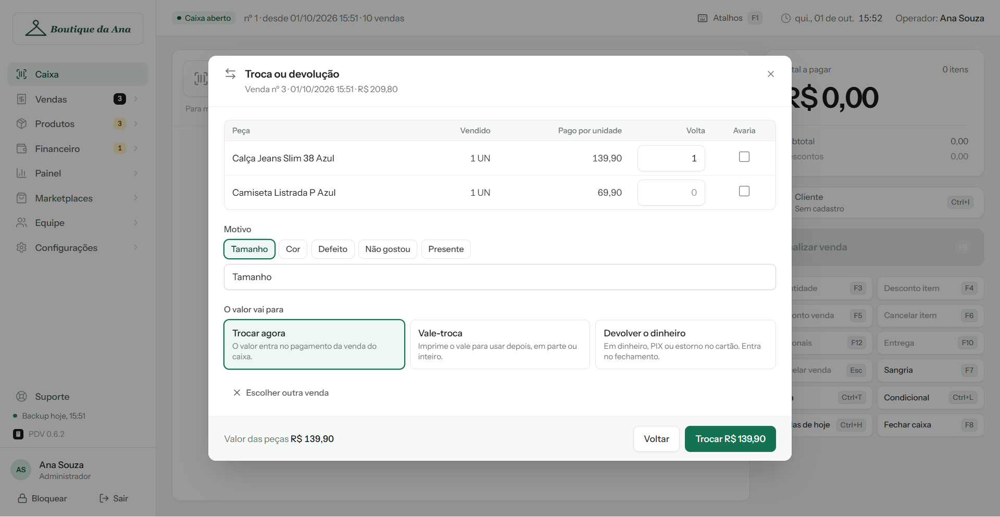

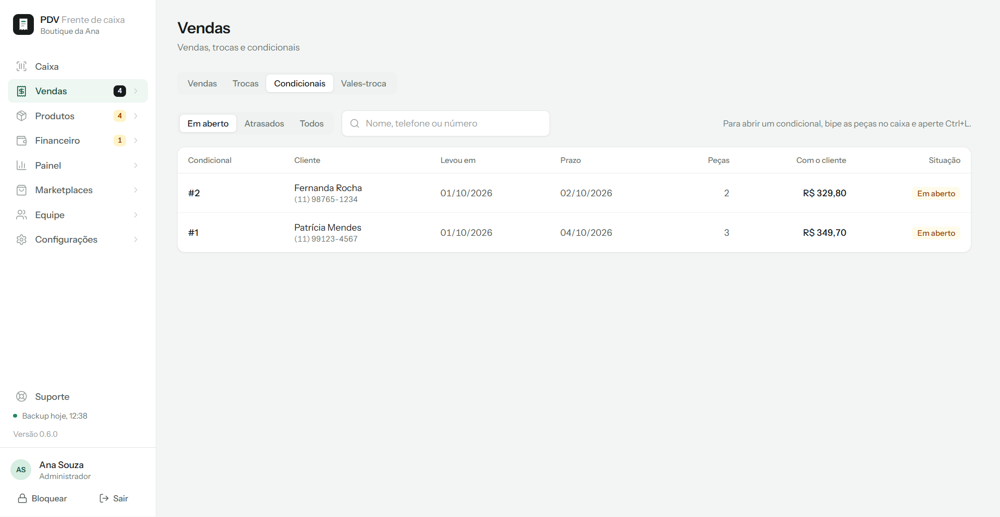

### Painel de vendas

No plano Básico, o painel mostra o essencial: vendido hoje e ontem, ticket médio, os últimos 7 dias, os mais vendidos da semana e o estoque em alerta. Nos planos Médio e Completo, o painel completo:

Faturamento, número de vendas, ticket médio, lucro bruto e itens vendidos, sempre comparados com o período anterior. Vendas por dia e por hora, formas de pagamento, produtos e categorias que mais vendem, vendas por operador e o **mapa de dias e horários de movimento**, para escalar a equipe e programar a reposição.

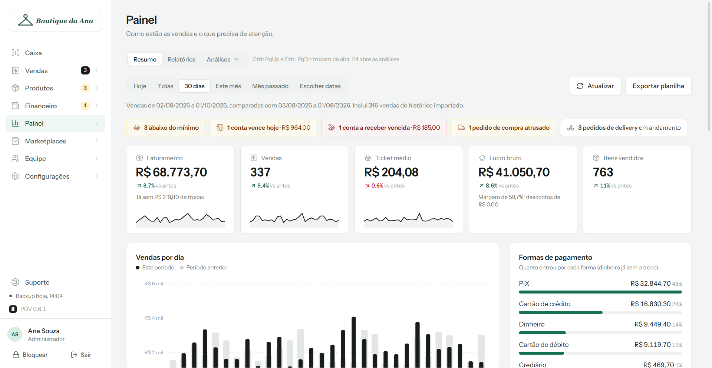

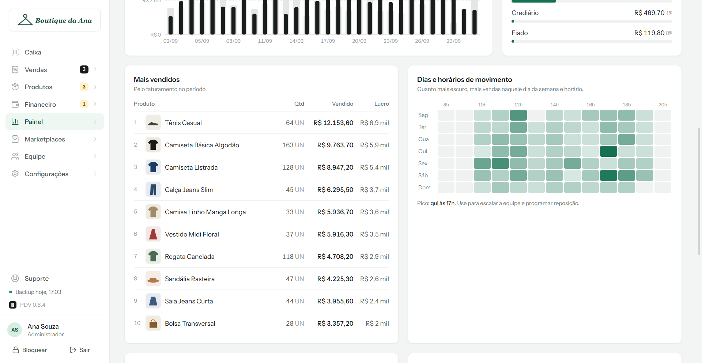

O mesmo painel no tema escuro (Configurações > Loja > Aparência):

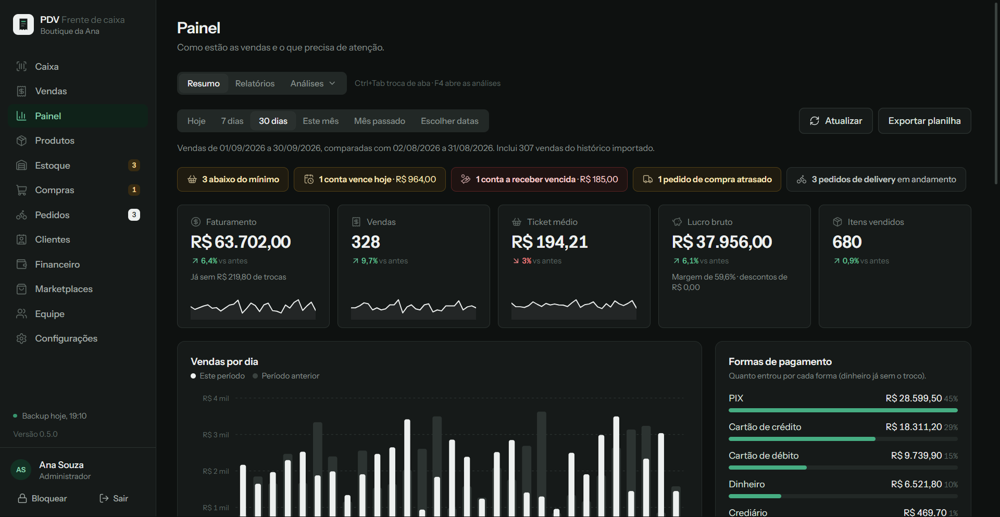

No topo do painel ficam os **alertas**: produtos zerados e abaixo do mínimo, contas vencidas ou vencendo hoje, pedidos de compra atrasados, pedidos de delivery em andamento e dinheiro parado em produtos que não vendem há 60 dias. O menu lateral mostra os números também (quantos produtos repor, quantas contas vencem).

### Relatórios e o lucro de verdade

O painel tem três abas: o Resumo, os Relatórios e as Análises (Ctrl+Tab passa de uma para outra), e o período escolhido em cima vale para todas.

**Relatórios** (planos Médio e Completo): vendas por período, produto, categoria, vendedor, forma de pagamento, horário e canal; descontos e cancelamentos; trocas e devoluções; posição e valor do estoque, **curva ABC**, giro e cobertura, produtos parados, falta de estoque e perdas. No plano Completo, também os financeiros: resultado do mês, contas a pagar e a receber, fluxo de caixa e as taxas das maquininhas. Cada um na tela, impresso, em PDF e em Excel, pronto para mandar ao contador.

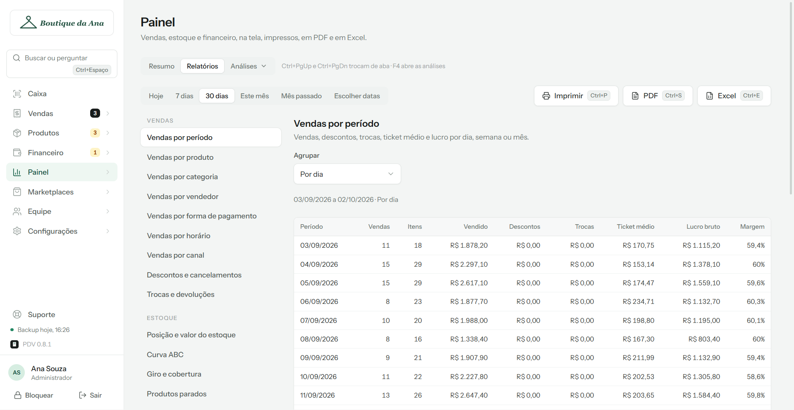

**Painel avançado** (plano Completo): quanto o seu negócio lucra de verdade, do preço de tabela ao lucro líquido, com os descontos, as trocas, o custo, as taxas do cartão, a tarifa e o frete do Mercado Livre e as despesas do mês. O **ponto de equilíbrio** mostra quanto vender no mês para pagar as contas, e a margem sai por produto, categoria, fornecedor, operador, forma de pagamento e canal.

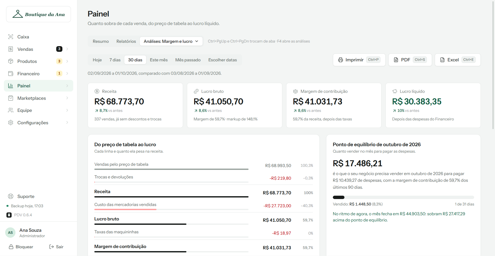

Nos produtos, a curva ABC (pelo faturamento, pela quantidade ou pelo lucro), o giro e a cobertura do estoque, o dinheiro parado e a **venda perdida por falta de estoque**, e os que vendem muito com margem baixa (hora de rever o preço). O **simulador** testa um preço ou um custo novo antes de mudar; a **meta do mês** mostra a previsão de fechamento e quanto vender por dia; e as compras mostram o custo que subiu e o preço que mantém a margem.

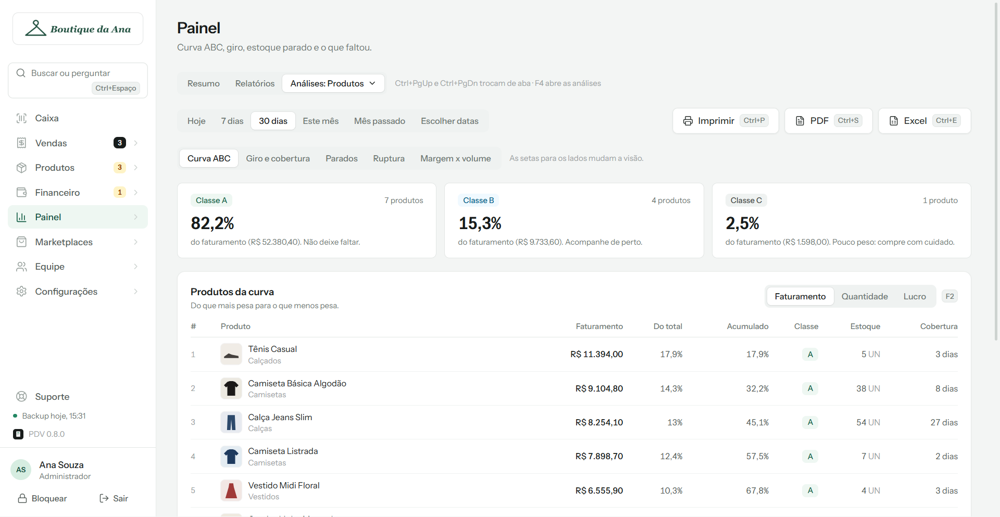

### Estoque

Quanto você tem, quanto vale (pelo custo e pelo preço de venda), o que precisa repor e tudo o que entrou e saiu. Entrada de mercadoria bipando as peças da nota, inventário com o leitor (dá para continuar vendendo durante a contagem), perdas e avarias com motivo, movimentações com filtro e planilha para o contador. O custo de cada produto é o custo médio das compras. Cada produto pode ter códigos extras com a quantidade (a caixa com 12, o fardo com 6 ou um segundo código de barras), e a entrada, o inventário e a nota do fornecedor contam certo.

**Validade e lote** (todos os planos; a loja liga em Configurações > Estoque, e cada produto escolhe se controla): a entrada pede a validade de cada lote do jeito que vem na embalagem (10/10/27, ou só o mês e o ano), e a nota do fornecedor já traz o lote do XML. Na venda sai sozinho o lote que vence primeiro, ou o caixa pergunta (para quem precisa saber o lote exato). Em Estoque > Validade, os vencidos, os que vão vencer (o aviso é de 30 dias, e cada produto pode ter o seu) e o estoque sem validade: Delete dá baixa no vencido, A acerta a quantidade, F2 corrige o lote. A venda cancelada e a troca voltam para o lote de onde saíram, o inventário conta por lote e os vencidos aparecem no Painel, no menu e no celular do dono.

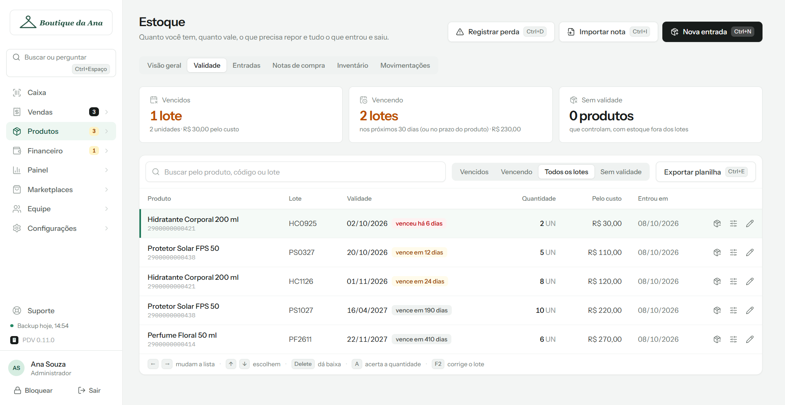

**Nota do fornecedor pelo XML**: importe o XML da nota (um, vários ou um .zip) e cada item se liga ao produto pelo código de barras ou pelo nome, com o custo real (frete, IPI e ST rateados) e a caixa com 12 virando 12 unidades. O sistema lembra o código de cada fornecedor, confere a nota com o pedido de compra (a mais, a menos, preço acima, fora do pedido), deixa fazer a contagem cega da mercadoria, cria os produtos novos com os dados da nota, sugere o preço que mantém a margem quando o custo sobe e lança as parcelas nas contas a pagar. No fim do mês, os XMLs saem num .zip para o contador.

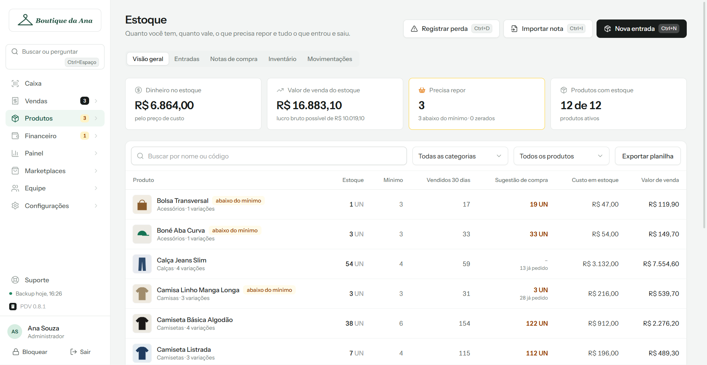

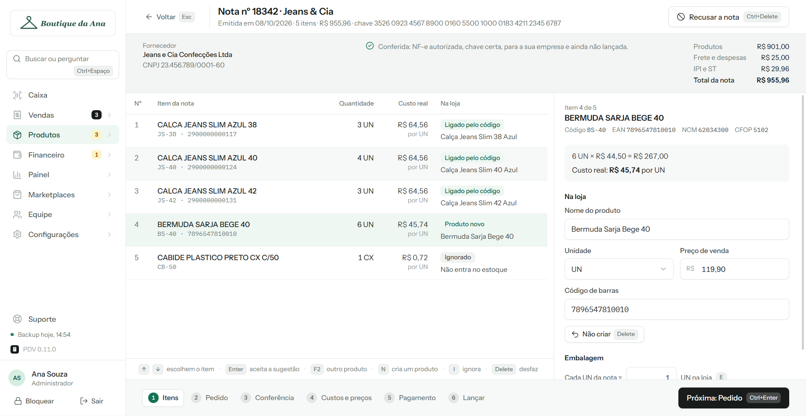

### Compras

Do "o que comprar" até pagar o fornecedor:

- **O que comprar**: a sugestão é o estoque mínimo mais a venda prevista (pela média de cada tamanho e cor), menos o estoque e o que já foi pedido e ainda não chegou, com a conta à vista em cada linha. Separado por fornecedor, com o pedido mínimo de cada um.
- **Pedido de compra**: monte em segundos a partir da sugestão e mande pelo WhatsApp do fornecedor (a conversa já abre com o pedido), em PDF ou copiando o texto. Cada pedido mostra se já foi mandado, se chegou uma parte ou se chegou tudo.
- **Recebimento com conferência**: chegou uma parte? Informe o que chegou; o resto fica em aberto. O estoque e o custo são atualizados e já dá para imprimir as etiquetas das peças que chegaram.
- **Preço pelo markup**: todos os produtos numa lista, com o custo, o preço de hoje, o markup que vale para cada um (o do produto, o da categoria ou o padrão da loja) e o preço sugerido. Filtre pela categoria ou pela situação (abaixo, acima ou no sugerido), aplique o sugerido nos que escolher e leve a lista para o Excel.
- **Fornecedores**: contato, WhatsApp, prazo de entrega, condição de pagamento, histórico de compras e último custo de cada produto.
- **Contas a pagar** (com o Financeiro): as parcelas do fornecedor (30/60/90) entram sozinhas no recebimento.

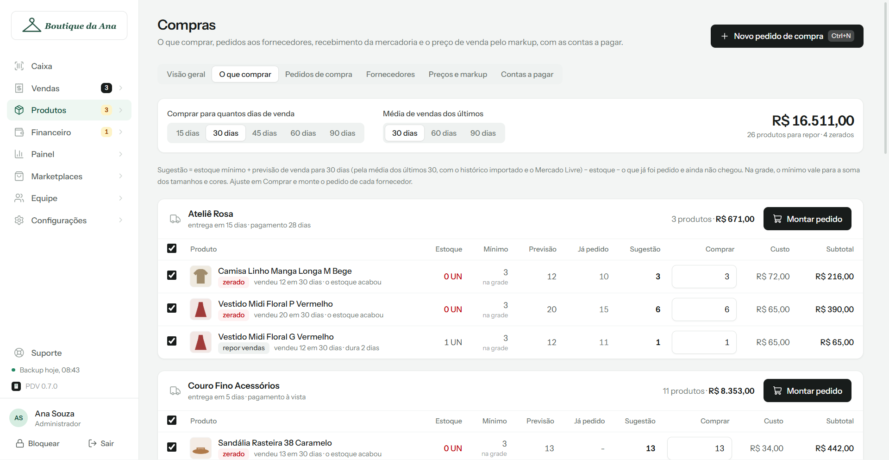

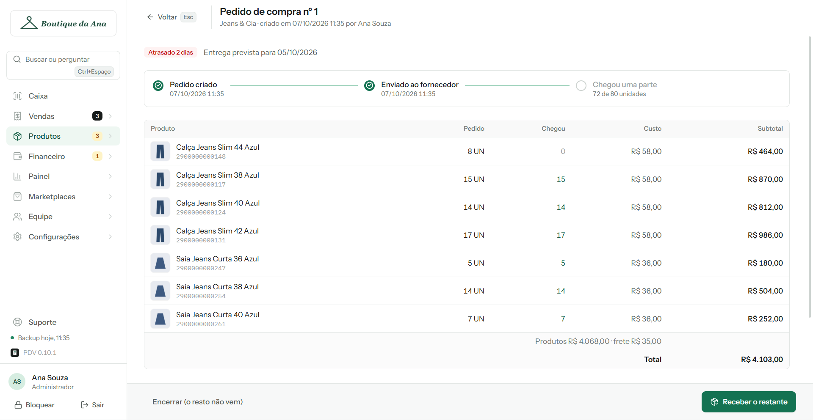

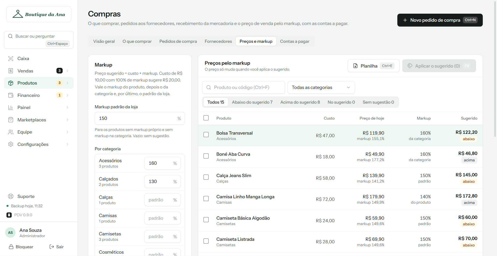

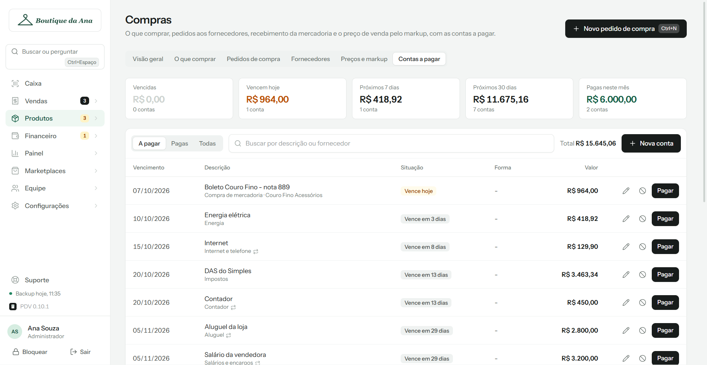

### Clientes

Cadastro com CPF ou CNPJ, WhatsApp, aniversário e endereço. No caixa, **Ctrl+I** escolhe o cliente: o nome e o CPF saem no cupom e a compra fica no cadastro dele. Você escolhe como o caixa trata o cliente: não usar (balcão rápido), opcional ou obrigatório em toda venda. Veja o que cada cliente compra, quanto gasta, os aniversariantes do mês e quem não volta há mais de 90 dias. Cadastros repetidos se juntam num só, e dá para trazer os clientes de uma planilha.

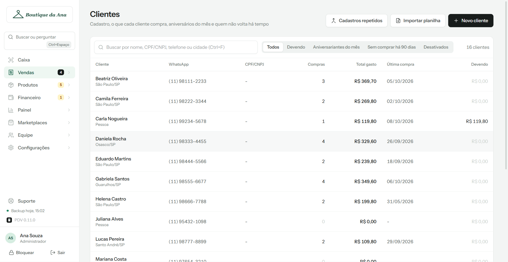

### Equipe

Cada pessoa da loja entra escolhendo o próprio nome e digitando a senha ou o PIN, ou bipando o crachá. O computador pode continuar conectado até a pessoa clicar em Sair, e a tela bloqueia na troca de turno sem fechar o caixa. Cada uma tem o perfil dela (administrador, gerente, caixa, estoquista, financeiro ou um montado por você), e o que passa do limite pede a senha de quem pode liberar, na hora. Veja [Segurança dos seus dados](#segurança-dos-seus-dados).

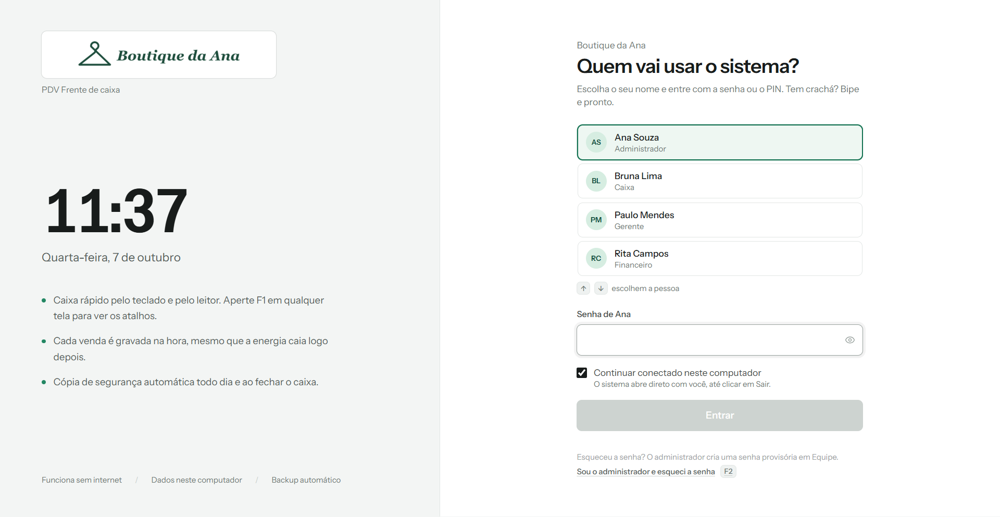

### A sua logo

Em Configurações > Loja, escolha a imagem da logo (ou arraste, ou cole). O ideal é quadrada e com fundo transparente, mas qualquer uma serve: o sistema tira as bordas vazias, ajusta sem cortar e mostra como fica no menu claro, no escuro e no cupom. Logo branca ganha um fundo escuro na tela e sai escura no papel. No cupom ela sai em preto e branco, e dá para desligar em cada computador se a impressora imprimir mal.

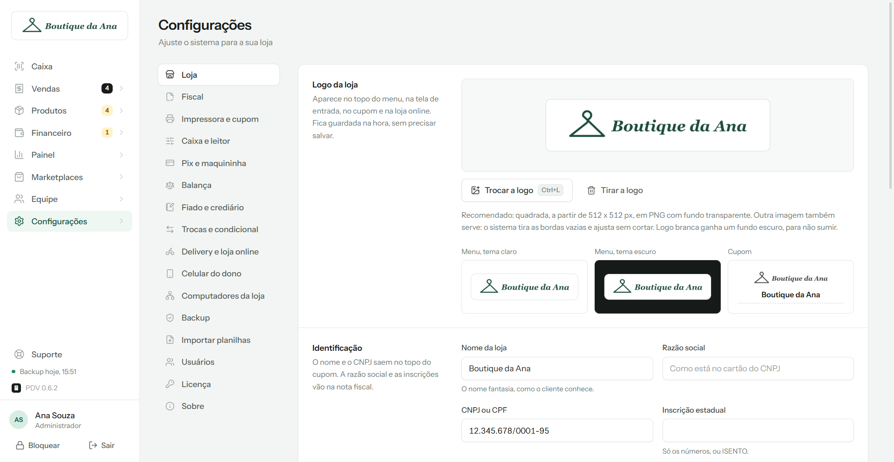

### Financeiro

- **Fiado e crediário no caixa.** O cliente leva e paga depois, de uma vez ou em até 12 parcelas, com carnê impresso. Cada cliente tem um limite de crédito: acima dele, só com a autorização de quem pode liberar.
- **Receber no caixa.** Ctrl+I, escolha o cliente e receba: o valor entra no fechamento do caixa, e a multa e os juros de atraso já vêm calculados.
- **Contas a pagar** com vencimentos e alertas: as parcelas das compras entram sozinhas, e o aluguel, a luz e as outras contas de todo mês também.
- **Maquininhas de cartão** de qualquer marca: cadastre as taxas e os prazos de cada uma e veja quanto cai na conta e em que dia. No caixa, com mais de uma maquininha, é só escolher em qual o cartão passou; as taxas saem do resultado do mês.
- **Saldos do caixa, do cofre e do banco.** Cada venda, recebimento, conta paga, sangria e fechamento de caixa entra sozinho na conta certa: você sabe quanto tem em cada lugar, com o extrato de cada um.
- **Previsão de caixa**: a partir dos saldos, quanto você vai ter em cada dia dos próximos 30, 60 ou 90 dias, com aviso se o saldo for ficar negativo.
- **Resultado do mês**: quanto o seu negócio lucrou, com as vendas, o imposto, o custo das mercadorias e as despesas, e os últimos 12 meses para comparar.
- **O imposto no lucro.** Informe o imposto sobre as vendas em Configurações > Fiscal (no Simples, a alíquota que o contador passa; no regime normal, a carga média; no MEI, o valor do DAS): o resultado do mês ganha a linha do imposto, e o lucro do painel, dos relatórios e do painel avançado já sai depois dele.

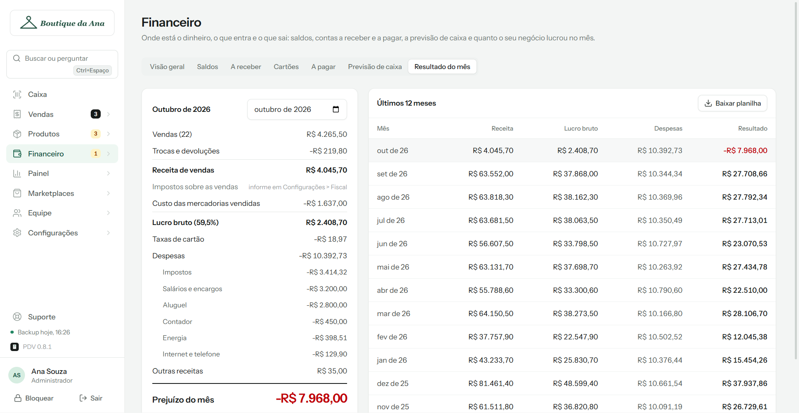

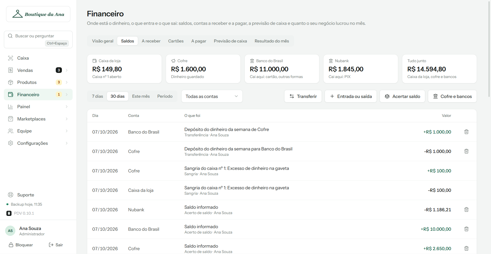

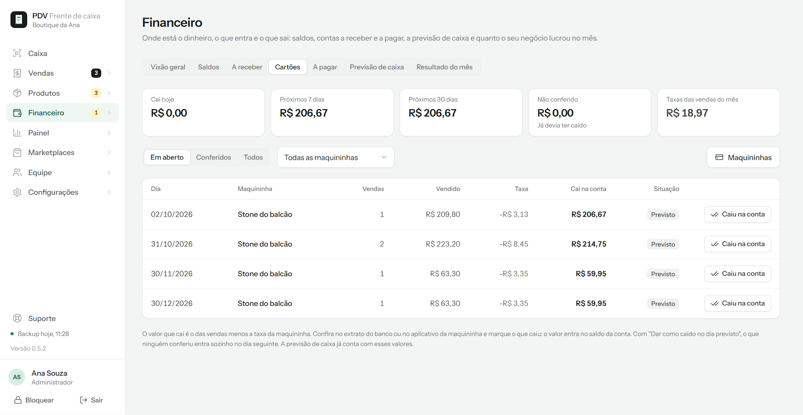

### Etiquetas com código de barras

Para produtos sem código ou com código próprio da loja: etiqueta com ou sem preço, nome da loja e referência. Rolos de etiqueta (40 x 25, 50 x 30, 60 x 40, três colunas, tag de roupa) e folhas A4 adesivas (65, 21 ou 14 etiquetas por folha), aproveitando folha já usada. A quantidade pode vir igual ao estoque em um clique.

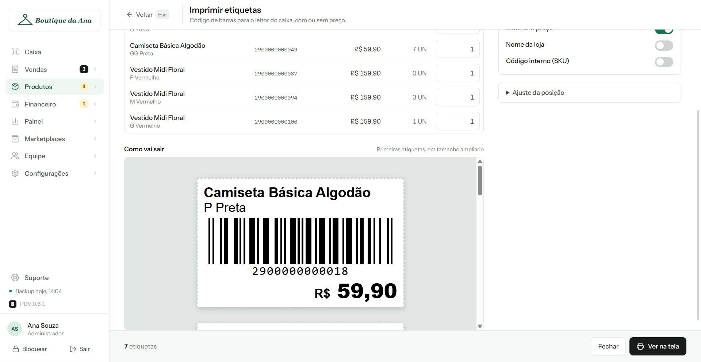

### Importar planilha

Produtos (com grade de tamanho e cor e venda por peso), fornecedores, clientes e histórico de vendas. Excel (.xlsx) ou CSV, inclusive o que outros sistemas exportam (a planilha de produtos do Bling entra com as variações e o código da embalagem). O sistema reconhece as colunas sozinho, mostra **exatamente** o que vai entrar, o que vai ser atualizado e as linhas com problema, e faz um backup antes de importar.

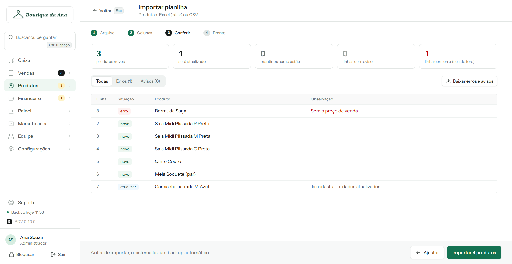

### Delivery, loja online e celular do dono

- **Pedidos para entrega e retirada** feitos no caixa (F10), com acompanhamento, entregador e via da cozinha.
- **Loja online**: uma página com os seus produtos, fotos e preços. O cliente pede pelo celular e o pedido cai direto em Pedidos, com aviso sonoro.
- **Celular do dono**: vendas do dia, caixa, pedidos e estoque baixo no celular, pelo Wi-Fi da loja, ou de qualquer lugar com link e PIN. No Wi-Fi, o celular é pareado uma vez pelo código que aparece no computador e depois entra sozinho, sem digitar senha.

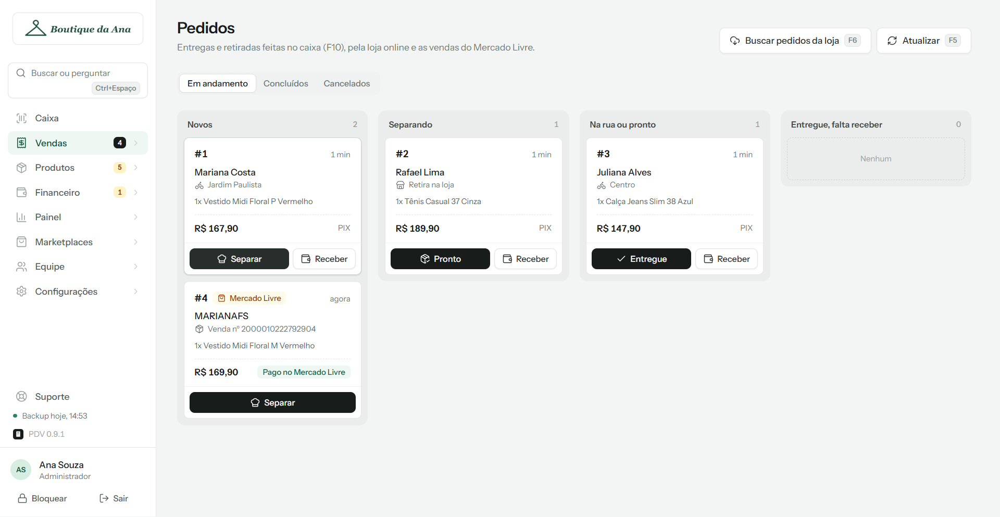

  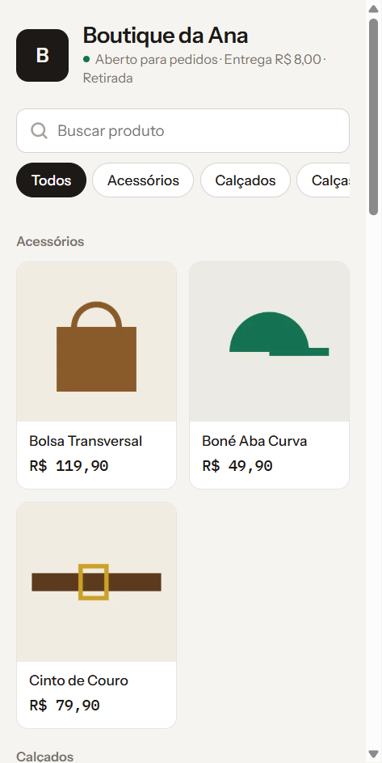
  &nbsp;&nbsp;
  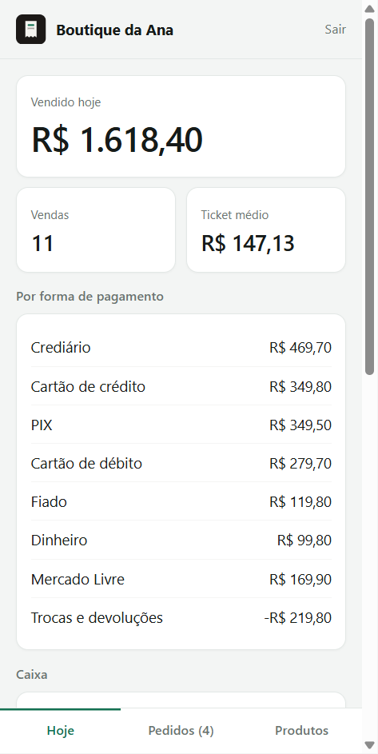

### Mercado Livre

- **As vendas caem no sistema.** Cada venda paga vira um pedido em Pedidos, para separar e embalar, e baixa o estoque da loja. Venda cancelada no Mercado Livre cancela o pedido e devolve o estoque.
- **Um estoque só para o balcão e os anúncios.** Vendeu no balcão, o anúncio atualiza em segundos. Antes de ligar, o sistema mostra o que muda em cada anúncio, e a margem de segurança guarda unidades para não vender a mesma peça duas vezes.
- **Anúncios ligados aos produtos sem digitar tudo de novo.** Quando o SKU do anúncio é o código de barras ou o código do produto, o sistema liga sozinho. Para o resto, ele sugere o produto pelo nome, pela cor e pelo tamanho, e você confirma.
- **Já vende no Mercado Livre? Os produtos vêm de lá.** Um clique (ou Ctrl+I) cadastra na loja os anúncios que ainda não têm produto, com o título, o preço, o estoque, o código de barras, as cores e os tamanhos e a foto do anúncio, e cada um já fica ligado. Você confere tudo antes de importar, e o produto que já existe na loja fica como está.
- **O preço também vai sozinho.** O preço da loja, com a porcentagem que você escolhe para cobrir a tarifa e o frete (ou um preço próprio por produto), vai para os anúncios em segundos. Antes de ligar, o sistema mostra o que muda, e o anúncio em promoção ou com o preço automático do Mercado Livre fica como está.
- **Anuncie sem sair do sistema.** No cadastro do produto, "Anunciar no Mercado Livre" sugere a categoria, pede só os campos que ela exige, mostra a tarifa do clássico e do premium e publica com a foto, o preço e o estoque da loja, já ligado ao produto.
- **O lucro de verdade de cada venda.** As vendas do Mercado Livre entram no painel, nos relatórios e no resultado do mês com a tarifa e o frete que a loja paga.
- **Tudo na página Marketplaces:** a conta, os anúncios, o estoque e as vendas. Vendas do Full ficam de fora: o Mercado Livre separa e envia do depósito dele.

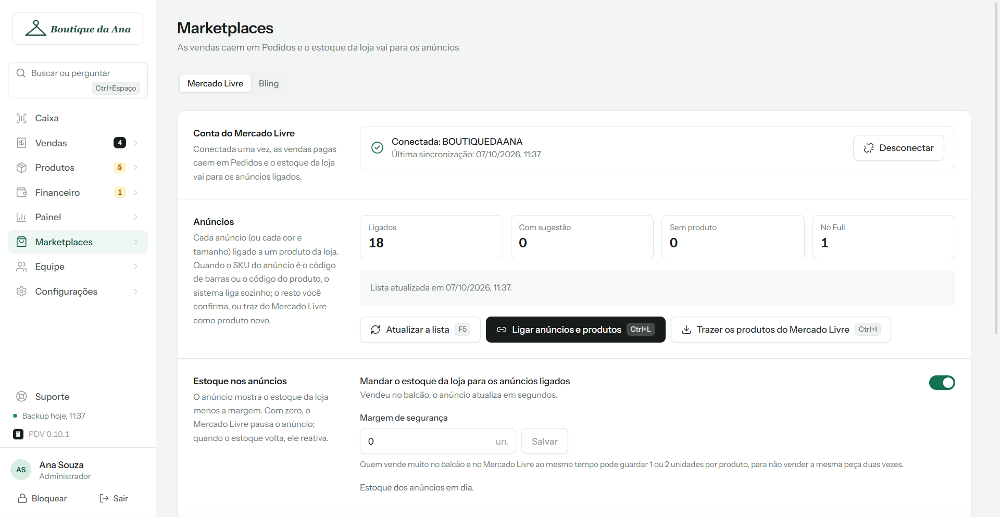

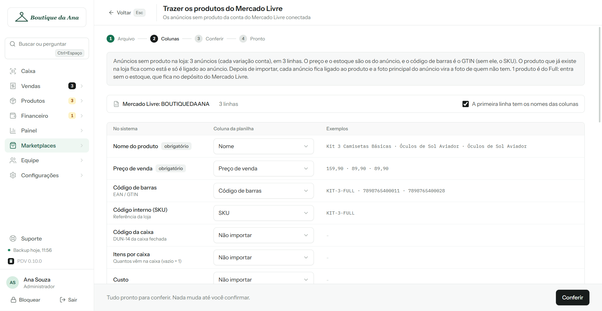

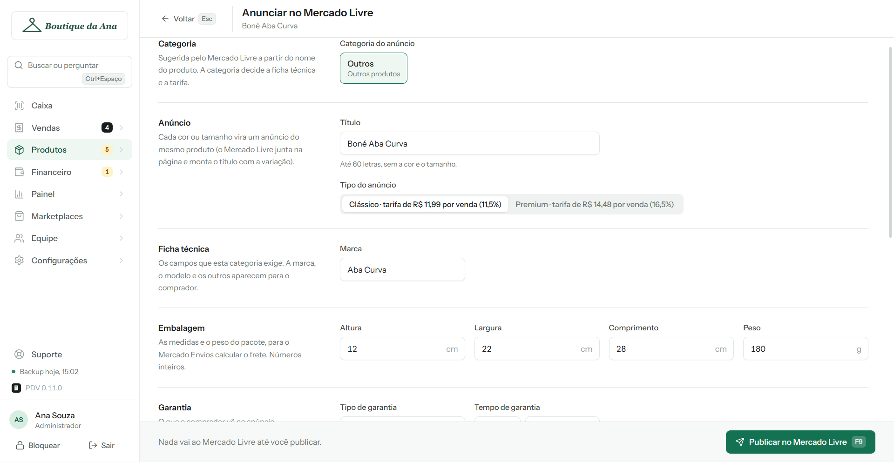

---

## Segurança dos seus dados

São os números do seu negócio: vendas, clientes, custos e contas. O sistema foi feito para eles ficarem com você e só quem você autorizar mexer neles.

- **Ficam no computador da loja.** Vendas, clientes, produtos e contas ficam no seu computador, não num servidor de terceiros. A internet só é usada para ativar, receber atualizações e para os módulos online.
- **Backup automático.** Todo dia, ao fechar o caixa, antes de importar uma planilha e antes de cada atualização. Com cópia extra no pendrive ou na pasta do Google Drive ou do OneDrive, se você quiser.
- **Cada pessoa com o seu usuário.** Perfis prontos (administrador, gerente, caixa, estoquista e financeiro) ou montados do seu jeito. Quem não tem a permissão não vê nem faz, e a trava vale no sistema inteiro, não só na tela. Quem cuida da equipe sem ser administrador não dá permissões que não tem e não mexe no usuário do administrador.
- **Senhas protegidas.** Senha, PIN e crachá nunca ficam guardados como foram digitados: nem abrindo o banco de dados dá para ler. Cinco tentativas erradas bloqueiam, e a espera cresce a cada bloqueio.
- **Esqueceu a senha do administrador?** Na tela de entrada, crie uma senha nova com a chave de ativação que veio na compra. Sem a chave, ninguém troca; vale só a chave que um administrador usou neste computador, e a troca fica no histórico.
- **Tudo registrado.** Vendas canceladas, descontos, sangrias, mudanças de preço e de estoque, usuários e permissões: o histórico mostra quem fez, quando e quem autorizou. Dá para exportar em planilha.
- **Autorização na hora, com a senha de quem libera.** Desconto acima do limite, cancelamento, sangria, fiado acima do limite, dispensa de juros, devolução em dinheiro e troca fora da regra só passam com a senha, o PIN ou o crachá de quem pode liberar, digitados na hora. Ninguém usa o nome do gerente sem ele, e o desconto liberado vale até o percentual autorizado, só naquela venda.
- **Vale-troca que não dá para inventar.** O código tem números sorteados e o saldo fica no sistema, não no papel. A segunda via cancela o papel antigo: quem achar o vale perdido não usa o saldo.
- **Fiado com trava.** Limite de crédito por cliente e, se precisar, o bloqueio da venda a prazo para quem está devendo.
- **Troca de operador sem fechar o caixa.** A tela bloqueia com Ctrl+B ou sozinha, depois do tempo que você escolher, e volta com o PIN ou o crachá.
- **Celular do dono sem expor a senha.** Pelo Wi-Fi da loja, o celular é pareado pelo código na tela do computador e a senha nunca passa pela rede; o painel só abre na rede da loja e você desconecta cada celular quando quiser. De qualquer lugar, o acesso é por link privado e PIN, com conexão cifrada, e bloqueia depois de 5 PINs errados.
- **Vários caixas com conversa cifrada.** Os computadores da loja conversam pela rede da loja com conexão cifrada. Só entra o computador aceito no principal, com um número conferido nas duas telas, e o principal desliga um caixa na hora.
- **Atualização só da fonte oficial.** O sistema só instala versões publicadas pelo fornecedor do sistema, e faz um backup antes.
- **Licença com assinatura digital.** Não dá para falsificar nem copiar para outro computador.
- **Pagamento integrado com trava.** As senhas e os certificados da maquininha e do banco ficam cifrados no computador; cada Pix ou cartão aprovado vale para uma venda só; e cartão ou Pix lançado à mão, com a integração ligada, só passa com a autorização de quem pode liberar.
- **Loja online protegida.** O preço do pedido é sempre o do seu cadastro, e o sistema barra quem tenta mandar pedidos em série.
- **Mercado Livre sem senha no sistema.** Você autoriza a conta no site do Mercado Livre. O acesso fica cifrado, preso à sua chave de ativação, e você desconecta quando quiser.

**Dica:** proteja também o computador. Use senha no Windows e, se o seu Windows tiver, ligue a criptografia do dispositivo (BitLocker).

---

## Planos

Pague uma vez só ou por mês. Todos os planos têm 7 dias grátis para testar e recebem as atualizações sem reinstalar nada. Para mudar de plano, peça ao vendedor: os módulos novos aparecem no sistema sem reinstalar.

| | Básico | Médio | Completo |
|---|---|---|---|
| **Pagamento único** | **R$ 49,90** | **R$ 69,90** | **R$ 99,90** |
| **Ou por mês** | R$ 19,90 | R$ 29,90 | R$ 49,90 |
| Computadores (no mesmo estoque) | 1 | 2 | 3 |
| Usuários incluídos | 2 | 3 | 5 |
| Caixa, produtos, vendas, cupom, backup e importação de planilhas | Sim | Sim | Sim |
| Assistente: achar as telas e o passo a passo | Sim | Sim | Sim |
| Assistente: perguntas sobre a loja (vendas, estoque e financeiro, com a fonte de cada número) | - | - | Sim |
| Trocas, devoluções, vale-troca e condicional | Sim | Sim | Sim |
| Pix e maquininha integrados | Sim | Sim | Sim |
| Balança (etiqueta e ligada ao computador) | Sim | Sim | Sim |
| Painel de vendas | Simples | Completo | Completo |
| Relatórios de vendas e de estoque (com a curva ABC), em PDF e Excel | - | Sim | Sim |
| Relatórios financeiros e painel avançado (lucro de verdade, simulador de preço, metas) | - | - | Sim |
| Gestão de estoque | Sim | Sim | Sim |
| Entrada pela nota do fornecedor (XML) | Sim | Sim | Sim |
| Validade e lote | Sim | Sim | Sim |
| Dados fiscais (NCM, CEST, grupos fiscais) | Sim | Sim | Sim |
| Compras, fornecedores e preço pelo markup | - | Sim | Sim |
| Clientes | - | Sim | Sim |
| Etiquetas com código de barras | - | Sim | Sim |
| Celular do dono pelo Wi-Fi da loja | - | 1 celular | 2 celulares |
| Financeiro | - | - | Sim |
| Delivery e pedidos | - | - | Sim |
| Loja online | - | - | Sim |
| Acesso de qualquer lugar (link e PIN) | - | - | Sim |
| Pedidos, estoque, preço e anúncios do Mercado Livre | - | - | Sim |

**Usuário extra:** R$ 9,90 por mês para caixa ou vendedor e R$ 14,90 para gerente ou financeiro. No pagamento único, R$ 24,90 e R$ 39,90.

---

## Impressoras

O sistema funciona com praticamente qualquer impressora instalada no Windows. Não precisa de programa extra: se o Windows imprime, o sistema imprime.

### Qual impressora usar

| Para quê | Tipo | Papel | Exemplos |
|---|---|---|---|
| Cupom do caixa (mais comum) | Térmica de cupom | Bobina 80 mm | Elgin i9 e i7, Epson TM-T20, Bematech MP-4200, Daruma DR800, Tanca TP-650, Knup, Gprinter, Xprinter |
| Pouco espaço no balcão | Térmica de cupom | Bobina 58 mm | Mini impressoras térmicas USB ou Bluetooth de 58 mm |
| Cupom sem impressora térmica | Comum (jato de tinta ou laser) | Folha A4 | HP, Epson, Brother, Canon, Samsung |
| Etiquetas em rolo | Térmica de etiquetas | Rolo de etiquetas | Argox OS-214 e OS-2140, Elgin L42 Pro, Zebra GC420t e ZD220 |
| Etiquetas em folha | Comum (jato de tinta ou laser) | Folha A4 adesiva com 65, 21 ou 14 etiquetas | Qualquer impressora comum |

Pode usar uma impressora para o cupom e outra para as etiquetas, e ainda uma terceira para a via da cozinha.

### Primeira vez: passo a passo

1. **Instale a impressora no Windows** com o programa (driver) do fabricante. Ele vem no CD ou no site da marca: procure no Google por "driver" e o modelo da impressora (exemplo: "driver Elgin i9"). Impressora comum (HP, Epson, Brother) costuma instalar sozinha pelo Windows Update.
2. **Ligue a impressora e conecte no computador** (USB ou rede). Coloque o papel.
3. **Abra o sistema.** Na primeira vez ele procura as impressoras e mostra um aviso no topo: "Encontramos a impressora ... Quer usar para os cupons?". Clique em **Usar esta impressora**.
4. **Siga o assistente.** Ele sugere o tamanho do papel pelo modelo, imprime uma página de teste com uma régua e pergunta como saiu. Se saiu cortado, pequeno ou em branco, ele diz exatamente o que ajustar.

Para mudar depois: **Configurações > Impressora e cupom > Configurar passo a passo**.

### O sistema avisa quando algo está errado

- Impressora **ligada no USB mas sem o programa (driver)**: aparece o nome que o aparelho informa, com o passo a passo para instalar.
- Impressora **desligada, sem papel, com a tampa aberta ou com papel enroscado**: a situação aparece no assistente e no aviso do topo da tela, do jeito que o Windows informa.
- **Impressoras virtuais** (PDF, OneNote, programas de acesso remoto) ficam separadas, para não serem escolhidas por engano.

### Problemas comuns

| O que acontece | O que fazer |
|---|---|
| A impressora não aparece na lista | Falta instalar o driver no Windows (passo 1). Depois de instalar, clique em "Procurar de novo" no assistente. |
| O cupom sai cortado dos lados | O papel escolhido está maior que a bobina. No assistente, escolha 58 mm em vez de 80 mm. |
| O cupom sai muito pequeno ou com folha em branco no fim | O driver está configurado para folha A4. Nas preferências da impressora no Windows, escolha o papel de 80 mm (ou 58 mm) e o tamanho "rolo". |
| Sai em branco | Na térmica, a bobina está ao contrário: o lado que escurece com a unha é o que imprime. |
| Imprime devagar ou trava | Impressora de rede com o endereço mudado: reinicie a impressora e o roteador, ou prefira o cabo USB. |
| Etiqueta sai deslocada | Na tela de etiquetas, abra "Ajuste da posição" e mova em milímetros para o lado ou para baixo. |
| Etiqueta A4 não bate com a folha | Confira se o modelo escolhido tem o mesmo número de etiquetas da sua folha. Para aproveitar uma folha já usada, use "Começar em". |
| Quero imprimir a via da cozinha em outra impressora | Configurações > Impressora e cupom > Via da cozinha: escolha a impressora da cozinha. |

### Leitor de código de barras

Não precisa instalar nada: o leitor USB funciona como um teclado. Conecte, abra o caixa e bipe. Se o leitor tiver o modo "enter no final" desligado, ligue pelo manual do leitor (ele lê um código de configuração).

---

## Instalação

**Requisitos:** Windows 10 ou 11 (64 bits), 4 GB de memória, 500 MB livres. Internet só para ativar.

1. [Baixe o instalador](https://github.com/G4Nobrega11/pdv-downloads/releases/latest/download/PDV-Instalador.exe) e abra o arquivo.
2. Se aparecer **"O Windows protegeu o computador"**, clique em **Mais informações** e depois em **Executar assim mesmo**. O aviso aparece com programas novos que ainda não são conhecidos pelo Windows. O instalador é o mesmo publicado nesta página.
3. A instalação termina sozinha e cria o atalho na área de trabalho.
4. Na primeira abertura, informe o nome da loja, o tipo de loja e crie o seu usuário de administrador.
5. Use por 7 dias grátis. Para continuar, digite o código de ativação que você recebeu na compra (Configurações > Licença).

**Trocou de computador?** No computador antigo, vá em Configurações > Licença > Desativar este computador. Depois ative no novo. Se o antigo quebrou, fale com o suporte para liberar.

**Levar os dados para o computador novo:** Configurações > Backup > Restaurar, escolhendo o arquivo de backup (do pendrive ou da nuvem).

---

## Perguntas frequentes

**Precisa de internet?**
Não para vender. A internet é usada para ativar, para receber atualizações, para falar com o suporte e para os módulos online (loja online, Mercado Livre e acesso de qualquer lugar).

**Emite nota fiscal (NFC-e, SAT)?**
Ainda não. É um sistema de controle da loja (caixa, estoque, compras e financeiro). O cadastro fiscal (dados da empresa, NCM, CEST, origem e grupos fiscais) já fica pronto no sistema, e as compras entram pelo XML da nota do fornecedor. Enquanto isso, use junto com o emissor indicado pela sua contabilidade.

**Onde ficam os meus dados?**
No computador da loja, com backup automático todo dia. Você pode escolher uma pasta extra (pendrive, Google Drive, OneDrive) para ter uma cópia fora do computador.

**Posso usar em mais de um computador?**
Sim, com o mesmo estoque: o computador principal guarda os dados e os outros viram caixas dele pela rede da loja, sem precisar de internet. Quantos, o plano diz: 1 no Básico, 2 no Médio e 3 no Completo.

**Posso escolher a tela do caixa?**
Sim. São duas: a de mercado, com a logo da loja no canto e o produto, o total e o troco em letras grandes (a que vem no mercadinho e no depósito), e a clássica, com a foto de cada peça (a que vem em roupas e lanchonete). Troque em Configurações > Caixa e leitor > Tela do caixa, em cada computador.

**Controla validade e lote?**
Sim, em todos os planos, e só liga quem precisa: em Configurações > Estoque, e depois em cada produto (ou de uma vez por categoria). A entrada pede a validade de cada lote, a venda tira do lote que vence primeiro (ou o caixa pergunta) e Estoque > Validade mostra o que venceu e o que vai vencer.

**Funciona com gaveta de dinheiro e balança?**
A gaveta que abre pela impressora térmica depende da configuração do driver da impressora. A balança funciona dos dois jeitos: a etiqueta que ela imprime entra bipada no caixa, e a balança ligada ao computador pesa sozinha (Toledo, Filizola, Urano e Elgin).

**Dá para mandar os relatórios para o contador?**
Sim. Nos planos Médio e Completo, cada relatório do painel sai impresso, em PDF e em Excel (vendas, estoque e, no Completo, o resultado do mês, as contas e o fluxo de caixa). Os XMLs das notas de compra do mês saem num .zip, em Estoque > Notas de compra.

**Tenho os produtos em outro sistema. Preciso cadastrar tudo de novo?**
Não. Exporte uma planilha do sistema antigo (Excel ou CSV) e importe em Produtos > Importar planilha. Dá para trazer também os fornecedores, os clientes e o histórico de vendas. A planilha de produtos que o Bling exporta o sistema reconhece sozinho, com as variações de tamanho e cor. E se você já vende no Mercado Livre, os anúncios viram produtos da loja direto da conta conectada, com o preço, o estoque, o código e a foto (plano Completo).

**Esqueci a senha. E agora?**
Quem não é administrador pede uma senha provisória ao administrador, em Equipe. O administrador clica em "Sou o administrador e esqueci a senha", na tela de entrada, e cria uma senha nova com a chave de ativação da compra. Perdeu a chave? O vendedor manda de novo.

**Como chegam as atualizações?**
Pela internet, sem reinstalar. Quando tiver versão nova, aparece "Atualização pendente" embaixo do menu (e na tela de entrada). Clique e confirme: a instalação aparece na tela, com um backup antes, e o sistema abre de novo sozinho, já atualizado e com você conectado. Se preferir, ela é instalada quando você fechar o sistema.

**O sistema tem inteligência artificial?**
Não. Tem um assistente com respostas preparadas pela equipe do sistema: ele acha as telas, mostra o passo a passo e responde sobre a loja com os números do próprio sistema. Por isso funciona sem internet e não tem custo por pergunta.

**Como peço ajuda?**
Para achar uma tela ou ver como fazer algo, aperte Ctrl+Espaço e pergunte ao assistente. Para falar com uma pessoa, aperte Ctrl+F1 em qualquer tela e conte o que aconteceu. O chamado vai com o print da tela, e a resposta aparece no próprio sistema. Veja [Suporte](#suporte).

**Quantos usuários posso criar?**
Depende do plano: 2 no Básico, 3 no Médio e 5 no Completo, e dá para contratar usuários extras de caixa ou de gerência. Cada pessoa entra escolhendo o próprio nome, com a senha, o PIN ou o crachá, e tem as permissões do perfil dela; o computador pode continuar conectado até a pessoa sair; descontos acima do limite pedem a autorização de quem pode liberar.

---

## Suporte

O suporte fica dentro do sistema. Aperte **Ctrl+F1** em qualquer tela (ou clique em **Suporte**, no pé do menu), escreva o assunto e conte o que aconteceu. O chamado vai com o print da tela de onde você abriu e com o diagnóstico do sistema (a versão, o Windows e os erros recentes; nada de senhas nem dados de clientes), direto para a equipe do sistema.

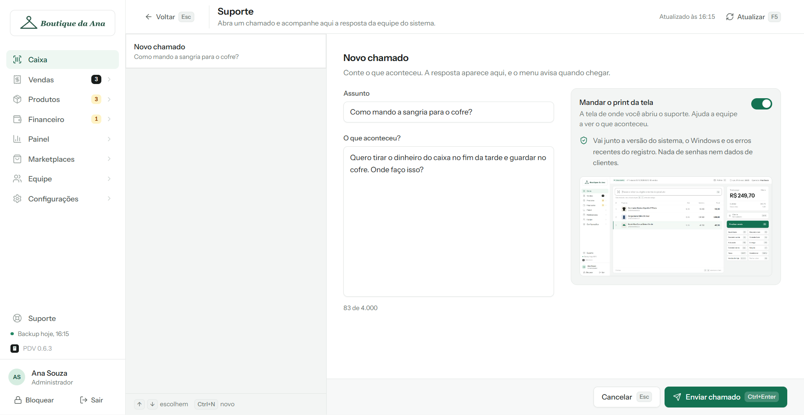

A resposta aparece no próprio sistema, numa conversa, e o menu mostra **Suporte respondeu** quando ela chega. Dá para responder de volta e marcar como resolvido; se o problema voltar, é só escrever no mesmo chamado. Sem internet, o chamado fica guardado e sai sozinho quando a conexão voltar.

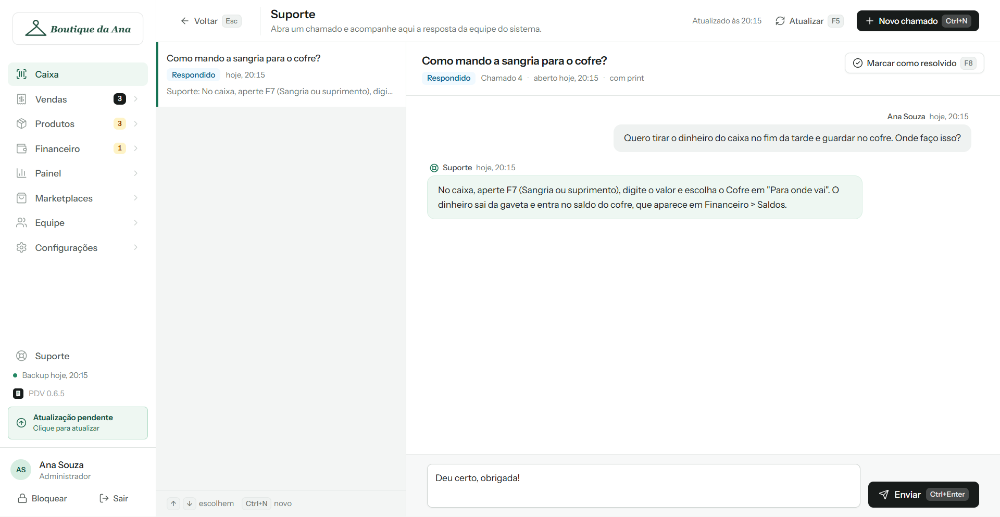

No período de teste, fale com quem te vendeu o sistema, pelo WhatsApp informado na compra. Os módulos que não estão no seu plano têm o botão **Pedir para liberar**, que já abre a conversa com a mensagem pronta.

  <a href="https://github.com/G4Nobrega11/pdv-downloads/releases/latest/download/PDV-Instalador.exe"><b>Baixar o instalador para Windows</b></a>

